# backrooms-level-zero-ue5-game-dev

**Backrooms Level Zero** is a short, atmospheric first-person exploration experience built in **Unreal Engine 5**, inspired by the iconic liminal space known as *The Backrooms*. The project focuses on environmental storytelling, mood, and immersion rather than traditional gameplay mechanics, recreating the unsettling feeling of endless, monotonous corridors.

- ✓ 40x40 meter room with 4-meter walls
- ✓ First person character with adjusted speed and camera
- ✓ Internal maze walls with baseboards
- ✓ Yellow materials on floor, walls, ceiling
- ✓ Grid texture on ceiling
- ✓ Noise texture on carpet
- ✓ Wallpaper on internal walls
- ✓ 49 ceiling lights in grid pattern
- ✓ Proper exposure settings
- ✓ Post-processing effects (bloom, chromatic aberration, dirt mask, film grain)
- ✓ Camera shake for movement
- ✓ VHS static ambient sound
- ✓ Trigger sound near graffiti
- ✓ Graffiti decal on wall
- ✓ Quit function (Q or Escape)
- ✓ Accurate Universal Fisheye Lens
- ✓ Packaged for Windows distribution

**All assets organized in folders:**
- Levels
- Materials
- Sounds
- Generated (modeling assets)
- Megascans (textures and decals)

---

# Development Documentation

## Table of Contents
- [backrooms-level-zero-ue5-game-dev](#backrooms-level-zero-ue5-game-dev)
- [Development Documentation](#development-documentation)
  - [Table of Contents](#table-of-contents)
  - [Game Design](#game-design)
    - [**Core Concept**](#core-concept)
    - [**Key Features**](#key-features)
      - [**Environment \& Level Design**](#environment--level-design)
      - [**Materials \& Visual Style**](#materials--visual-style)
      - [**Lighting \& Atmosphere**](#lighting--atmosphere)
      - [**Post-Processing Effects**](#post-processing-effects)
      - [**Player Experience**](#player-experience)
      - [**Audio Design**](#audio-design)
      - [**Environmental Storytelling**](#environmental-storytelling)
    - [**Technical Highlights**](#technical-highlights)
    - [**Controls**](#controls)
    - [**Target Audience**](#target-audience)
  - [Game Development](#game-development)
  - [**PROJECT SETUP**](#project-setup)
    - [**Creating New Project**](#creating-new-project)
    - [**Creating New Level**](#creating-new-level)
    - [**Viewport Navigation Controls**](#viewport-navigation-controls)
    - [**Setting Floor Size**](#setting-floor-size)
    - [**Saving the Level**](#saving-the-level)
  - [**UE HEAVY USEAGE FIX**](#ue-heavy-useage-fix)
  - [**CREATING EXTERIOR WALLS**](#creating-exterior-walls)
    - [**Using Modeling Tools**](#using-modeling-tools)
    - [**Creating First Wall**](#creating-first-wall)
    - [**Naming the Wall**](#naming-the-wall)
    - [**Creating Remaining Three Walls**](#creating-remaining-three-walls)
    - [**Setting Up Snapping**](#setting-up-snapping)
    - [**Duplicating Walls**](#duplicating-walls)
    - [**Organizing Walls**](#organizing-walls)
  - [**SETTING UP FIRST PLAYER VIEW**](#setting-up-first-player-view)
    - [**Save Project**](#save-project)
    - [**Restore Single Viewport**](#restore-single-viewport)
    - [**Adding Player Start**](#adding-player-start)
    - [**Testing Play Mode**](#testing-play-mode)
    - [**Modifying First Person Character**](#modifying-first-person-character)
    - [**Issues to Fix:**](#issues-to-fix)
    - [**Steps:**](#steps)
    - [**Removing Hand:**](#removing-hand)
    - [**Changing Walk Speed:**](#changing-walk-speed)
    - [**Adjusting Camera Height:**](#adjusting-camera-height)
    - [**Finalizing:**](#finalizing)
  - [**CREATING INTERNAL WALLS**](#creating-internal-walls)
    - [**Save Progress**](#save-progress)
    - [**Creating Wall Segment**](#creating-wall-segment)
    - [**Creating Baseboard**](#creating-baseboard)
    - [**Positioning Baseboard**](#positioning-baseboard)
    - [**Merging Wall and Baseboard**](#merging-wall-and-baseboard)
    - [**Laying Out Internal Walls**](#laying-out-internal-walls)
    - [**Setting Up Dual View:**](#setting-up-dual-view)
    - [**Creating L-Shape Segment:**](#creating-l-shape-segment)
    - [**Creating Group of Four:**](#creating-group-of-four)
    - [**Duplicating Groups:**](#duplicating-groups)
    - [**Set Traps \& Shortcuts**](#set-traps--shortcuts)
    - [**Organizing Internal Walls:**](#organizing-internal-walls)
    - [**Testing:**](#testing)
  - [**CREATING MATERIALS**](#creating-materials)
    - [**Basic Yellow Material**](#basic-yellow-material)
    - [**Creating Material:**](#creating-material)
    - [**Setting Up Yellow Color:**](#setting-up-yellow-color)
    - [**Removing Shininess:**](#removing-shininess)
    - [**Applying to Floor:**](#applying-to-floor)
    - [**Applying to Exterior Walls:**](#applying-to-exterior-walls)
    - [**Applying to Internal Walls:**](#applying-to-internal-walls)
    - [**Testing:**](#testing-1)
  - [**CREATING CEILING AND LIGHTING**](#creating-ceiling-and-lighting)
    - [**Creating Ceiling**](#creating-ceiling)
    - [**Setting Up View:**](#setting-up-view)
    - [**Duplicating Floor to Ceiling:**](#duplicating-floor-to-ceiling)
    - [**Removing External Lighting:**](#removing-external-lighting)
    - [**Creating Luminous Ceiling Material**](#creating-luminous-ceiling-material)
    - [**Duplicating Material:**](#duplicating-material)
    - [**Making Emissive:**](#making-emissive)
    - [**Applying Ceiling Material:**](#applying-ceiling-material)
    - [**Setting Up Exposure Control**](#setting-up-exposure-control)
    - [**Adding Post Process Volume:**](#adding-post-process-volume)
    - [**Configuring Volume:**](#configuring-volume)
    - [**Setting Manual Exposure:**](#setting-manual-exposure)
    - [**Adding Grid Texture to Ceiling**](#adding-grid-texture-to-ceiling)
    - [**Using Quixel Bridge:**](#using-quixel-bridge)
    - [**Applying Texture:**](#applying-texture)
    - [**Basic Texture Application:**](#basic-texture-application)
    - [**Adjusting Tile Scale:**](#adjusting-tile-scale)
    - [**Further Scaling:**](#further-scaling)
    - [**Adding Yellow Tint:**](#adding-yellow-tint)
    - [**Adjusting Exposure:**](#adjusting-exposure)
  - [**CREATING CEILING LIGHTS**](#creating-ceiling-lights)
    - [**Creating Light Material**](#creating-light-material)
    - [**New Material:**](#new-material)
    - [**Setting Up White Emissive:**](#setting-up-white-emissive)
    - [**Creating Light Cube**](#creating-light-cube)
    - [**Adding Cube:**](#adding-cube)
    - [**Positioning Cube:**](#positioning-cube)
    - [**Centering Cube:**](#centering-cube)
    - [**Renaming:**](#renaming)
    - [**Distributing Lights**](#distributing-lights)
    - [**Setting Up Views:**](#setting-up-views)
    - [**Creating Light Grid:**](#creating-light-grid)
    - [**Organizing:**](#organizing)
    - [**Adjusting Ceiling Material:**](#adjusting-ceiling-material)
    - [**Adjusting Exposure:**](#adjusting-exposure-1)
  - [**CREATING CARPET MATERIAL**](#creating-carpet-material)
    - [**Duplicating Base Material:**](#duplicating-base-material)
    - [**Current State:**](#current-state)
    - [**Adding Noise Texture:**](#adding-noise-texture)
    - [**Testing Noise:**](#testing-noise)
    - [**Applying to Floor:**](#applying-to-floor-1)
    - [**Adjusting Tile Density:**](#adjusting-tile-density)
    - [**Adding Yellow Color:**](#adding-yellow-color)
  - [**ADDING WALLPAPER TEXTURE**](#adding-wallpaper-texture)
    - [**Getting Wallpaper from Quixel Bridge**](#getting-wallpaper-from-quixel-bridge)
    - [**Finding Texture:**](#finding-texture)
    - [**Creating Wallpaper Material:**](#creating-wallpaper-material)
    - [**Setting Up Material:**](#setting-up-material)
    - [**Applying to Walls:**](#applying-to-walls)
    - [**Testing Basic Application:**](#testing-basic-application)
    - [**Adjusting Scale:**](#adjusting-scale)
    - [**Converting to Yellow:**](#converting-to-yellow)
    - [**Color Blending:**](#color-blending)
    - [**Using Linear Interpolate (Lerp):**](#using-linear-interpolate-lerp)
    - [**Result:**](#result)
  - [**ADDING POST-PROCESSING EFFECTS**](#adding-post-processing-effects)
    - [**Using Post Process Volume:**](#using-post-process-volume)
    - [**Adjusting Bloom:**](#adjusting-bloom)
    - [**Chromatic Aberration:**](#chromatic-aberration)
    - [**Lens Dirt Mask:**](#lens-dirt-mask)
    - [**Film Grain:**](#film-grain)
  - [**ADDING CAMERA SHAKE**](#adding-camera-shake)
    - [**Purpose:**](#purpose)
    - [**Creating Camera Shake Blueprint**](#creating-camera-shake-blueprint)
    - [**Steps:**](#steps-1)
    - [**Configuring Camera Shake:**](#configuring-camera-shake)
    - [**Setting Duration:**](#setting-duration)
    - [**Setting Rotation Parameters:**](#setting-rotation-parameters)
    - [**Saving:**](#saving)
    - [**Applying to First Person Camera**](#applying-to-first-person-camera)
    - [**Steps:**](#steps-2)
    - [**Adding Shake Component:**](#adding-shake-component)
    - [**Configuring Shake Source:**](#configuring-shake-source)
    - [**Testing:**](#testing-2)
  - [**ADDING GRAFFITI DECAL**](#adding-graffiti-decal)
    - [**Purpose:**](#purpose-1)
    - [**Getting Graffiti from Quixel Bridge**](#getting-graffiti-from-quixel-bridge)
    - [**Finding Decal:**](#finding-decal)
    - [**Downloading:**](#downloading)
    - [**Applying Graffiti**](#applying-graffiti)
    - [**Dragging Decal:**](#dragging-decal)
    - [**Rotating Decal:**](#rotating-decal)
    - [**Scaling Decal:**](#scaling-decal)
    - [**Positioning:**](#positioning)
    - [**Modifying Decal Appearance**](#modifying-decal-appearance)
    - [**Adjusting Opacity:**](#adjusting-opacity)
    - [**Changing Settings:**](#changing-settings)
  - [**ADDING AUDIO**](#adding-audio)
    - [**Two Audio Components Needed:**](#two-audio-components-needed)
    - [**Preparing Sound Files**](#preparing-sound-files)
    - [**File Requirements:**](#file-requirements)
    - [**Importing Sounds:**](#importing-sounds)
    - [**Previewing Sounds:**](#previewing-sounds)
    - [**Setting Up Looping:**](#setting-up-looping)
    - [**Adding VHS Static Sound to Player**](#adding-vhs-static-sound-to-player)
    - [**Steps:**](#steps-3)
    - [**Adding Audio Component:**](#adding-audio-component)
    - [**Configuring Audio:**](#configuring-audio)
    - [**Testing:**](#testing-3)
    - [**Creating Trigger Box for Eerie Sound**](#creating-trigger-box-for-eerie-sound)
    - [**Creating Blueprint:**](#creating-blueprint)
    - [**Adding Box Collision:**](#adding-box-collision)
    - [**Adding Audio Component:**](#adding-audio-component-1)
    - [**Setting Sound:**](#setting-sound)
    - [**Setting Up Trigger Logic:**](#setting-up-trigger-logic)
    - [**Connecting Audio:**](#connecting-audio)
    - [**Result:**](#result-1)
    - [**Placing Trigger in Level**](#placing-trigger-in-level)
    - [**Steps:**](#steps-4)
    - [**Positioning Trigger:**](#positioning-trigger)
    - [**Scaling Trigger:**](#scaling-trigger)
    - [**Testing:**](#testing-4)
    - [**Full Screen Mode:**](#full-screen-mode)
  - [**FISHEYE EFFECT**](#fisheye-effect)
    - [**Initial Setup**](#initial-setup)
    - [**Creating the Material**](#creating-the-material)
    - [**Configuring Material Domain**](#configuring-material-domain)
    - [**Building the Material Graph**](#building-the-material-graph)
    - [**Creating Material Instance**](#creating-material-instance)
    - [**Implementing in Scene**](#implementing-in-scene)
    - [**Testing and Customization**](#testing-and-customization)
    - [**Gameplay Testing**](#gameplay-testing)
  - [**FIX WALL COLLISION**](#fix-wall-collision)
  - [**PACKAGING THE GAME**](#packaging-the-game)

---

## Game Design

---

### **Core Concept**

The player is placed inside a vast, enclosed maze of yellow wallpapered rooms with humming fluorescent lights, worn carpet, and subtle environmental details. There are no objectives, enemies, or HUD elements—only the act of wandering, listening, and absorbing the oppressive atmosphere. The experience is designed to evoke unease through repetition, isolation, and sensory distortion.

---

### **Key Features**

#### **Environment & Level Design**

* 40×40 meter playable space with 4-meter-high walls
* Maze-like internal layout using modular wall segments
* Exterior boundary walls to fully enclose the level
* Ceiling grid with evenly spaced fluorescent light fixtures
* Minimalistic geometry to emphasize liminal emptiness

#### **Materials & Visual Style**

* Custom murky yellow wall material inspired by Level Zero
* Procedural carpet material using noise textures
* Wallpaper material with subtle pattern variation
* Ceiling tile material with grid scaling
* Matte surfaces to avoid unrealistic shine

#### **Lighting & Atmosphere**

* Emissive ceiling light panels for fluorescent lighting
* Manual exposure control using a global Post Process Volume
* Carefully tuned brightness for a gloomy, washed-out look
* No natural light sources (no sun/sky lighting)

#### **Post-Processing Effects**

* Subtle bloom for light bleed
* Chromatic aberration for old-camera lens distortion
* Film grain for analog/VHS-style noise
* Dirt mask for lens grime and age
* Fixed exposure to prevent brightness shifting

#### **Player Experience**

* First-person movement with reduced walking speed
* Adjusted camera height for realistic perspective
* Continuous procedural camera shake to simulate nervous motion
* No visible player body or hands for immersion

#### **Audio Design**

* Constant looping VHS static ambient sound
* Positional eerie sound triggered near graffiti
* Audio spatialization for environmental depth

#### **Environmental Storytelling**

* Single graffiti decal to break repetition
* Sound trigger linked to visual landmark
* Encourages exploration and curiosity without guidance

---

### **Technical Highlights**

* Built using Unreal Engine 5 First Person template
* Modular assets created with UE5 Modeling Tools
* Clean project organization (Levels, Materials, Sounds, Megascans, Generated assets)
* Optimized for Windows PC distribution
* Shipping build configuration for performance and smaller size

---

### **Controls**

* **WASD** – Move
* **Mouse** – Look around
* **Q / Escape** – Quit game
* **F11** – Fullscreen (during play)

---

### **Target Audience**

* Fans of liminal spaces and Backrooms lore
* Indie horror and atmospheric exploration enthusiasts
* Developers learning environment design, lighting, and post-processing in UE5

---

**Backrooms Level Zero** demonstrates how minimal gameplay elements, when combined with strong lighting, sound design, and post-processing, can create a deeply unsettling and memorable experience.

---

## Game Development

## **PROJECT SETUP**

### **Creating New Project**
- Launch Unreal Engine 5 editor
- Select **Game** section
- Choose **First Person** template
- Settings to use:
  - Desktop maximum quality
  - No starter content
  - No ray tracing
- Name the project (example: "BackroomsLevelZero ")(no underscore)
- Click Create
- Click Dismiss on plugins dialog
- Click Update on project files out of date notification

### **Creating New Level**
- Go to File menu → New Level
- Choose **Basic Level** template
- Click Create
- This provides sky, atmosphere (temporary for lighting), and floor

### **Viewport Navigation Controls**
- Hold right mouse button and use:
  - **W** - Move forward
  - **S** - Move backward
  - **A** - Move left
  - **D** - Move right
  - **Q** - Move down
  - **E** - Move up

### **Setting Floor Size**
- Select floor in viewport (also shows in outliner panel)
- Check Details panel for scale
- Default scale: 8x8 (each unit = 10 meters)
- Click lock button to change all axes together
- Change to **4** for 40 square meter room (4x4 scale)
- Press **F** to focus/frame selected element in viewport

### **Saving the Level**
- Click Save button (top shows "untitled" with asterisk)
- Right-click in project folder → Create New Folder
- Name folder: "levels"
- Double-click into folder
- Name level: "BackroomsLevel0" (no spaces allowed)
- Click Save

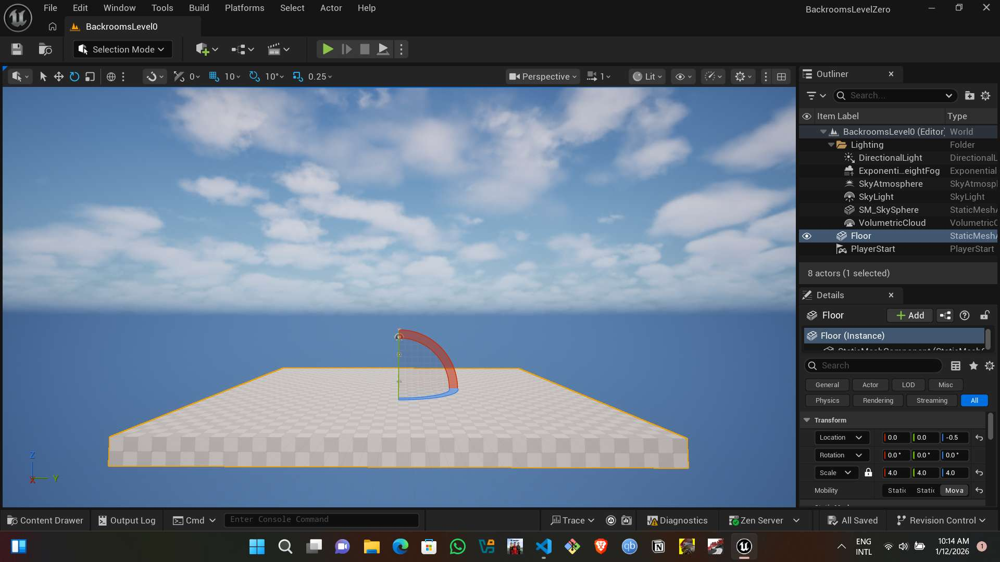

---

## **UE HEAVY USEAGE FIX**

* Open your Unreal Engine project
* In **Outliner**, select **VolumetricCloud**
* Press **Delete**

---

* In **Outliner**, select **SkyAtmosphere**
* Press **Delete**

---

* In the viewport (top-right):

  * Click **Lit**
  * Select **Unlit**

---

* Go to **Edit → Project Settings → Rendering**
* Set **Global Illumination Method** → `None`
* Set **Reflection Method** → `Screen Space`
* Restart Unreal Engine

---

* Go to **Edit → Project Settings → Rendering**
* Set **Shadow Map Method** → `Shadow Maps`

---

* Save project
* Restart Unreal Engine

---

## **CREATING EXTERIOR WALLS**

### **Using Modeling Tools**
- Click "Select Mode" at top → Choose **Modeling** mode
- Go to bottom gear icon → Settings:
  - Change Asset Generation Location to **Global Asset Path**
  - Untick "Per User Autogen Subfolder"
  - This saves all created items to "generated" folder at project top level
- Close settings

### **Creating First Wall**
- Click **Box** shape tool
- Set dimensions:
  - **Width**: 4000 cm (40 meters - matches floor)
  - **Depth**: 20 cm (wall thickness)
  - **Height**: 400 cm (4 meters high)
- Assign temporary material:
  - Type "blue" in material search
  - Select any blue (example: "Adam Sharing Blue")
  - Note: Must have "Show Engine Content" and "Show Plugin Content" enabled in settings
- Drag box to viewport edge near front
- When positioned, click **Complete** button
- Press **F** to zoom in and check alignment
- Use arrows to adjust position if needed

### **Naming the Wall**
- Select wall in outliner
- Press **F2** to rename
- Name: "OutsideWall"
- Press Ctrl+Space to open content browser
- Navigate to "generated" folder
- Find wall, press F2, rename to "OutsideWall"
- Press Ctrl+Space again to close content browser

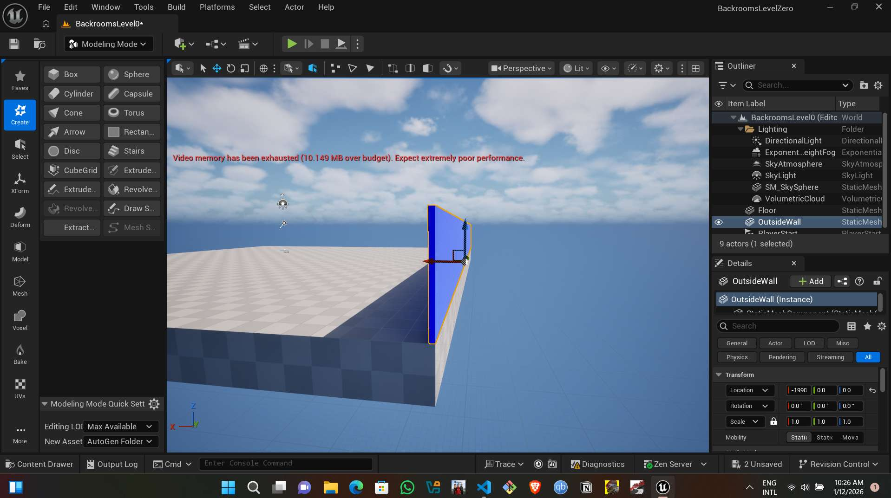

### **Creating Remaining Three Walls**
- Exit Modeling mode: Click Select at top
- Set up dual viewport:
  - Click three-line menu (burger menu) on viewport
  - Go to Layouts → Choose **Two Panel** layout
  - Left panel: Set to **Top** view and **Wireframe** mode
  - Right panel: Perspective view
  - Use scroll wheel to zoom in/out
  - Right mouse button to pan

### **Setting Up Snapping**
- At top toolbar, enable snapping(magnet icon) checkboxes
- Set snap value to **100 centimeters (1 meter)**

### **Duplicating Walls**
- Select first wall
- Hold **Alt** key + drag wall to opposite side (creates duplicate)

- Duplicate again into middle of room
- Press **E** key to rotate (changes to rotation tool)
- Rotate 90 degrees (snaps to 10-degree increments)
- Press **W** key to return to move tool
- Move rotated wall to one side
- Hold Alt + drag to create fourth wall on opposite side

### **Organizing Walls**
- In outliner, click first wall
- Shift+click last wall to select all
- Right-click → Move to Create New Folder
- Name folder: "OutsideWalls"
- Collapse folder

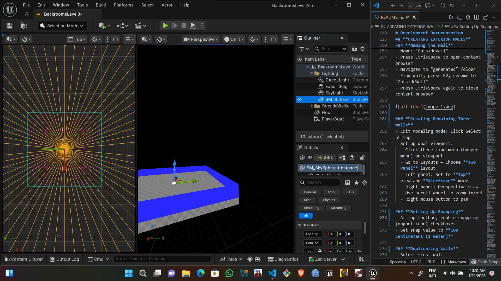

---

## **SETTING UP FIRST PLAYER VIEW**

### **Save Project**
- Click Save icon (remove asterisk from title)

### **Restore Single Viewport**
- In perspective view, click "Restore Viewport" (top right)

### **Adding Player Start**
- Click **Add** menu at top
- Go to **Basic** submenu
- Find **Player Start**
- Drag and drop near wall
- Small capsule appears - automatically pins to floor

### **Testing Play Mode**
- Click **Play** button
- Click viewport to activate
- Use W, A, S, D to move
- Press **Escape** to exit play mode

### **Modifying First Person Character**

### **Issues to Fix:**
- Remove crash test dummy hand from view
- Slow down movement speed
- Adjust camera height

### **Steps:**
- Press Ctrl+Space for content browser
- Go to top level Content
- Search for "first"
- Find "BP_FirstPersonCharacter"
- Double-click to open
- Drag to top of screen if opens in separate window

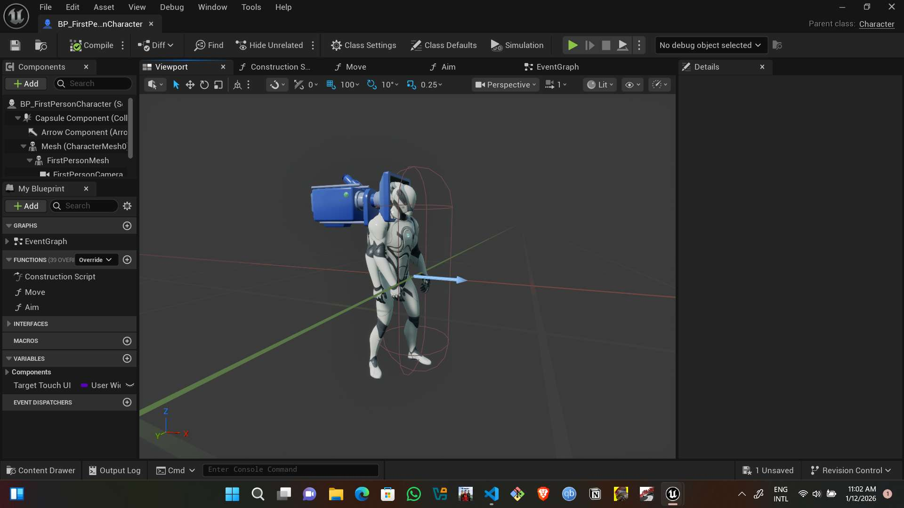

### **Removing Hand:**
- Click **Viewport** tab at top
- Select "FirstPersonMesh" (highlights hands)
- In Details panel, search for "hidden"
- Check **Hidden in Game**

### **Changing Walk Speed:**
- Select "Character Movement" component
- In Details, find "Character Movement: Walking"
- Change **Max Walk Speed** from 600 to **200** centimeters/second

### **Adjusting Camera Height:**
- Select Camera
- Change Z location from 60 to **120** centimeters
- Or drag camera up with blue arrow

### **Finalizing:**
- Click **Compile** and **Save**
- Close first person character
- Test in Play mode

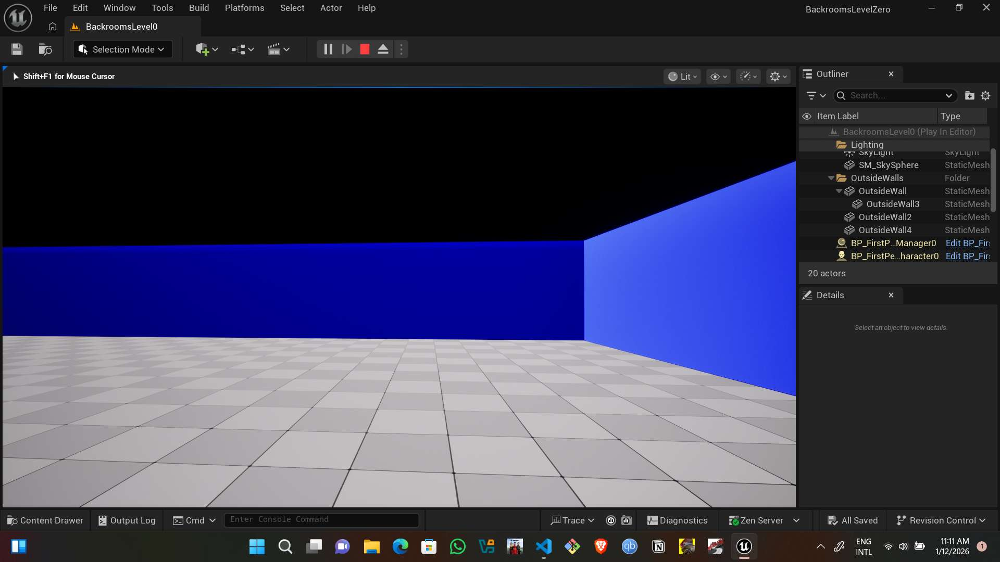

---

## **CREATING INTERNAL WALLS**

### **Save Progress**
- Click Save or press Ctrl+S

### **Creating Wall Segment**
- Go to Select Mode → **Modeling**
- Use **Box** tool
- Set dimensions:
  - **Width**: 400 cm (4 meters)
  - **Height**: 400 cm (4 meters)
  - **Depth**: 20 cm (thickness)
- Material: Keep blue
- Place roughly in center
- Click **Complete**
- Press **F** to zoom in

### **Creating Baseboard**
- Use Box tool again
- Dimensions:
  - **Height**: 20 cm
  - **Width**: 405 cm (5cm overhang)
  - **Depth**: 25 cm (sticks out front and back)
- Material: Change to **green** for contrast
- Place in front of wall (don't worry about exact position)
- Click **Complete**

### **Positioning Baseboard**
- Exit Modeling mode → Click Select
- Change position snapping from 100 to **10**
- Select Box2 (baseboard)
- Drag to align with wall bottom
- Should see 2.5cm overhang on each side

### **Merging Wall and Baseboard**
- Select Box (main wall)
- Shift+select Box2 (baseboard)
- Go to Tools → **Merge Actors**
- Dialog appears showing two boxes
- Leave merge settings as default
- Check **Replace Source Actors**
- Click **Merge Actors**
- Save location: "generated" folder
- Name: "BackroomWallSegment" (no spaces)
- Click Save
- Close dialog box

### **Laying Out Internal Walls**

### **Setting Up Dual View:**
- Click top right for two-panel view
- Left: Top wireframe view
- Right: Perspective view
- Zoom in on wall segment

### **Creating L-Shape Segment:**
- Select wall segment
- Press **W** for move tool
- Hold **Alt** + drag to duplicate
- Press **E** to rotate 90 degrees
- Press **W** to position next to first wall
- Change snapping to 10 for fine adjustment
- Check perspective view for alignment
- Select both segments, press **Ctrl+G** to group

### **Creating Group of Four:**
- Change snapping back to 100 (1 meter)
- Select L-shaped group
- Hold Alt + duplicate multiple times
- Leave 1-2 meters between segments
- Create 4 L-shaped segments in a pattern
- Press **E** to rotate different segments:
  - Top right: Rotate 180 degrees
  - Others: Rotate as desired for maze layout
- Select all four, press **Ctrl+G** to group

### **Duplicating Groups:**
- Position first group roughly in center
- Hold Alt + drag to create more groups
- Create full row of wall groups
- Select entire row, press Ctrl+G to group
- Hold Alt + duplicate row to top
- Hold Alt + duplicate row to bottom
- Creates full maze layout

### **Set Traps & Shortcuts**
- Randomize Patterns
- Set Wall Stuck Traps
- Set Shortcuts
- Some Areas Suffocated
- Some Areas Wide
- Some Seem Similar But have Traps

### **Organizing Internal Walls:**
- Click restore viewport (top right)
- Zoom out to see full maze
- In outliner, select all internal wall segments
- Right-click → Move to Create New Folder
- Name: "InternalWalls"
- Collapse folder

### **Testing:**
- Save project
- Click Play to test
- Navigate through maze
- Press Escape to exit

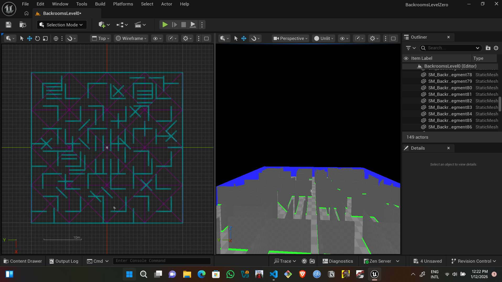

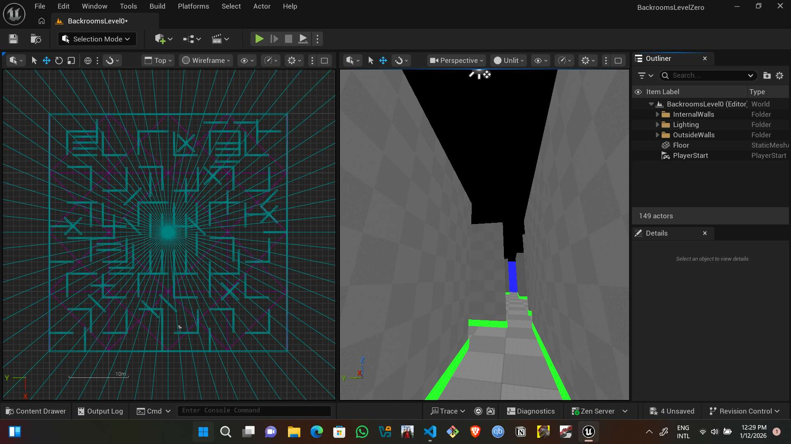

---

## **CREATING MATERIALS**

### **Basic Yellow Material**

### **Creating Material:**
- Press Ctrl+Space for content browser
- Go to top level
- Right-click → Create New Folder: "Materials"
- Open Materials folder
- Right-click → New Material
- Name: "M_BackroomYellow"
- Double-click to open
- Drag to top of screen to dock

### **Setting Up Yellow Color:**
- Left-click empty space in material graph
- Press **3** key + left-click (creates color node)
- Default is black - double-click to open
- Set RGB values:
  - **Red**: 1
  - **Green**: 1
  - **Blue**: 0
  - This creates bright yellow
- Reduce brightness:
  - Change **Value** from 1 to **0.05**
  - Creates murky/dirty yellow
- Click OK
- Connect color output to **Base Color** input

### **Removing Shininess:**
- Press **1** key + left-click (creates scalar value)
- Default value is 0 (what we want)
- Connect to **Specular** input
- Preview now shows matte yellow finish
- Click **Save**

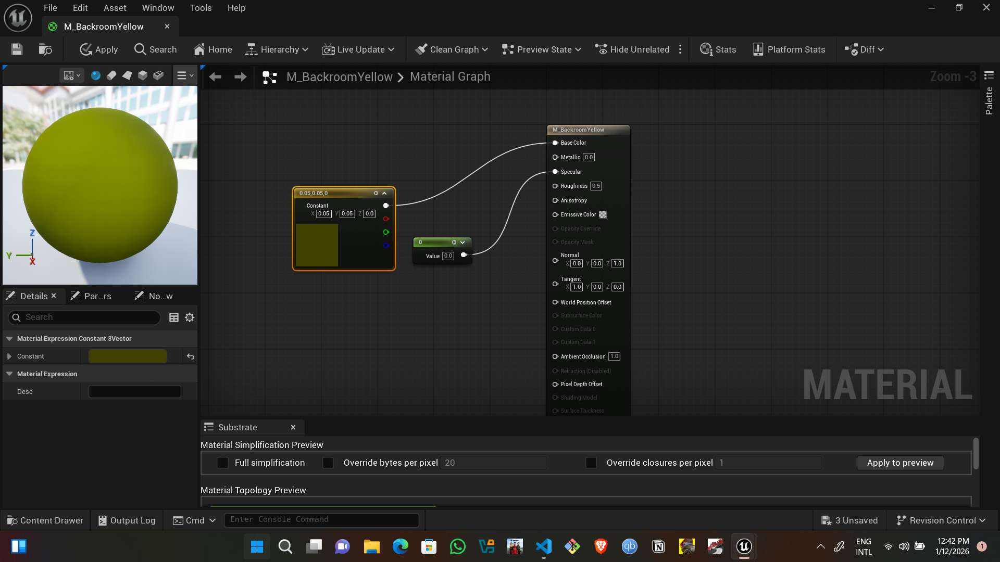

### **Applying to Floor:**
- Collapse folders in outliner
- Select Floor
- In Details → Materials section
- Click dropdown on material
- Type "backroom"
- Select "M_BackroomYellow"
- Floor changes to murky yellow

### **Applying to Exterior Walls:**
- Open OutsideWalls folder
- Select first wall
- Shift+click last wall (all selected)
- In Details → Materials
- Change blue material to "M_BackroomYellow"

### **Applying to Internal Walls:**
- Open InternalWalls folder
- Select all groups (first, shift+middle, shift+last)
- Press **Shift+G** to ungroup (or right-click → Group → Ungroup)
- With all selected, change both materials to "M_BackroomYellow"

### **Testing:**
- Click Play
- Everything now murky yellow
- Press Escape to exit

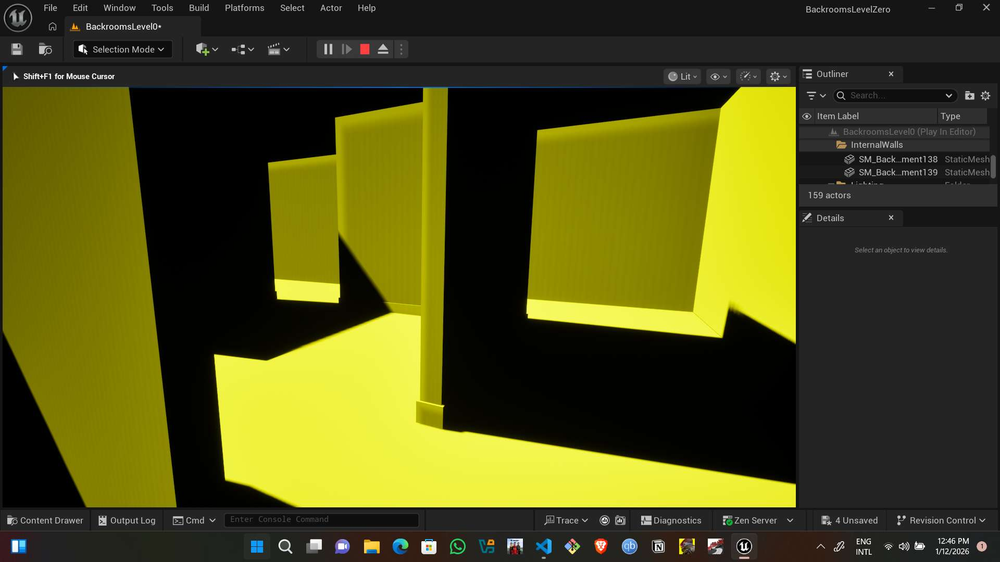

---

## **CREATING CEILING AND LIGHTING**

### **Creating Ceiling**

### **Setting Up View:**
- Click maximize/restore viewport for two-panel view
- Set left panel to **Left** view (side view)
- Keep right panel as perspective

### **Duplicating Floor to Ceiling:**
- Select Floor (in outliner, perspective view, or side view)
- Set grid snap value to **100** (1 meter)
- Hold **Alt** + drag floor up to ceiling height
- Snaps to top at 4 meters
- Go back to single viewport (restore viewport)
- In outliner, select "Floor2"
- Press F2, rename to "Ceiling"

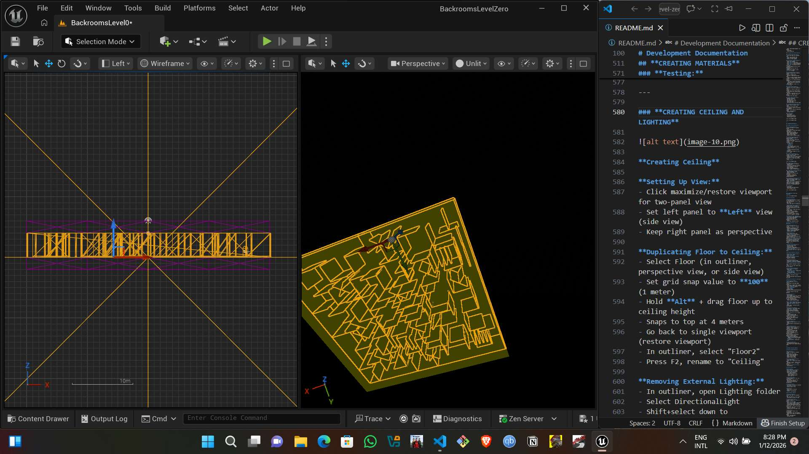

### **Removing External Lighting:**
- In outliner, open Lighting folder
- Select DirectionalLight
- Shift+select down to VolumetricCloud (all items)
- Delete
- Scene goes completely black

### **Creating Luminous Ceiling Material**

### **Duplicating Material:**
- Press Ctrl+Space for content browser
- Navigate to Materials folder
- Select "M_BackroomYellow"
- Press **Ctrl+D** to duplicate
- Rename: "M_BackroomCeiling"
- Double-click to open

### **Making Emissive:**
- Select yellow color node
- Change **Value** from 0.05 to **1** (full brightness)
- Delete specular connection (not needed for emissive)
- Hold **Ctrl** + drag yellow from Base Color to **Emissive Color**
- Or disconnect from Base Color and connect to Emissive Color
- Preview shows glowing yellow sphere
- Click **Save**

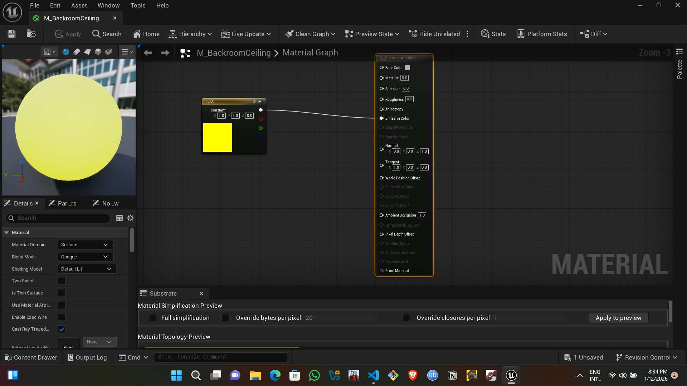

### **Applying Ceiling Material:**
- Go back to main level
- Select Ceiling
- In Details → Materials
- Change from M_BackroomYellow to **M_BackroomCeiling**
- Ceiling glows and casts light on walls

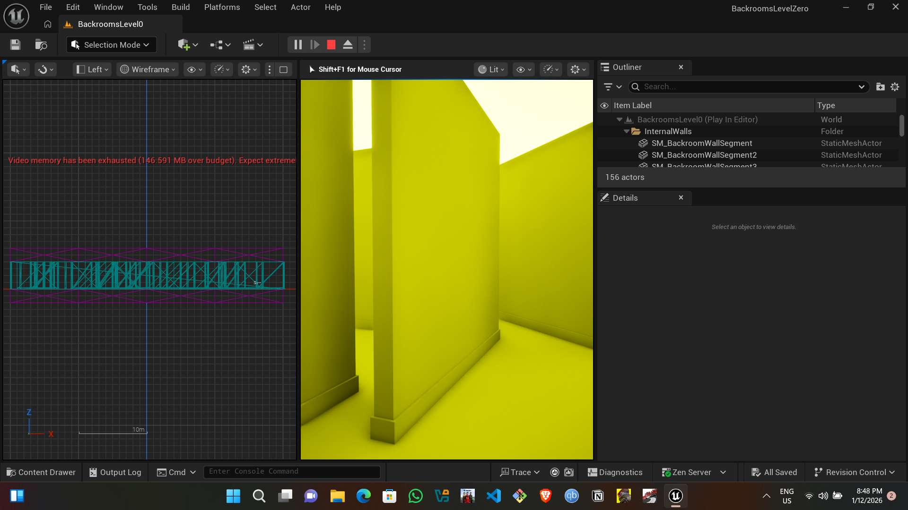

### **Setting Up Exposure Control**

### **Adding Post Process Volume:**
- Click **Add** menu
- Go to **Volumes**
- Drag **Post Process Volume** into scene (anywhere)
- Appears in outliner

### **Configuring Volume:**
- Select Post Process Volume
- In Details, search for "unbound"
- Check **Infinite Extent (Unbound)**
- This applies settings to entire room
- Press **X** to clear search and see all details

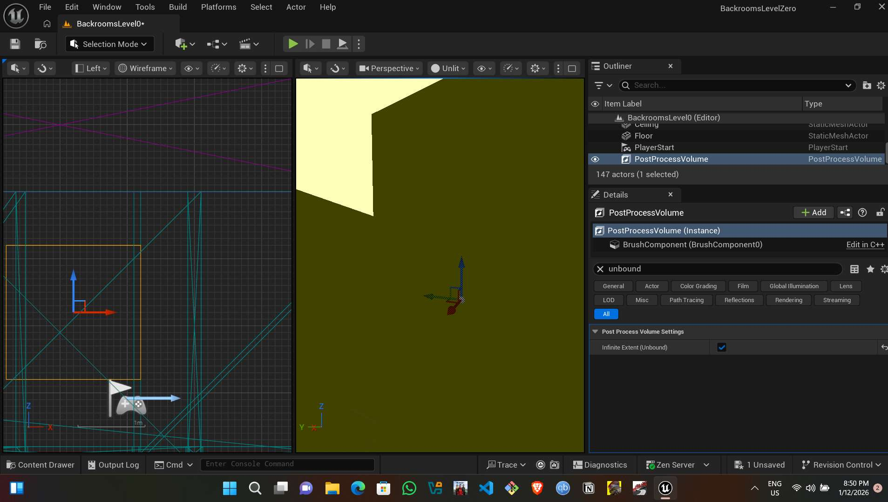

### **Setting Manual Exposure:**
- Find **Exposure** section
- Check both:
  - **Metering Mode**: Change from Auto to **Manual**
  - Scene goes black
- Set **Exposure Compensation** to **10**
- Creates consistent, gloomy lighting
- No auto-adjustment when entering play mode

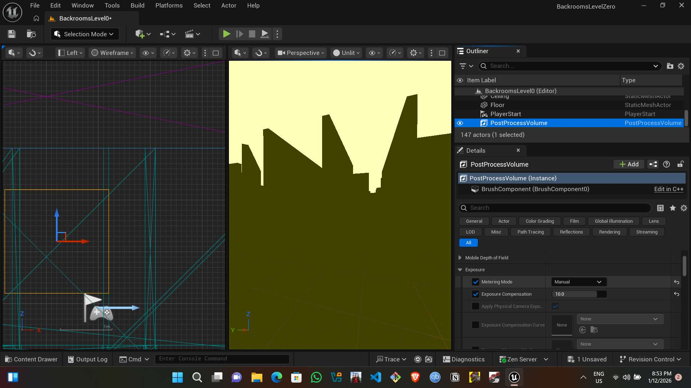

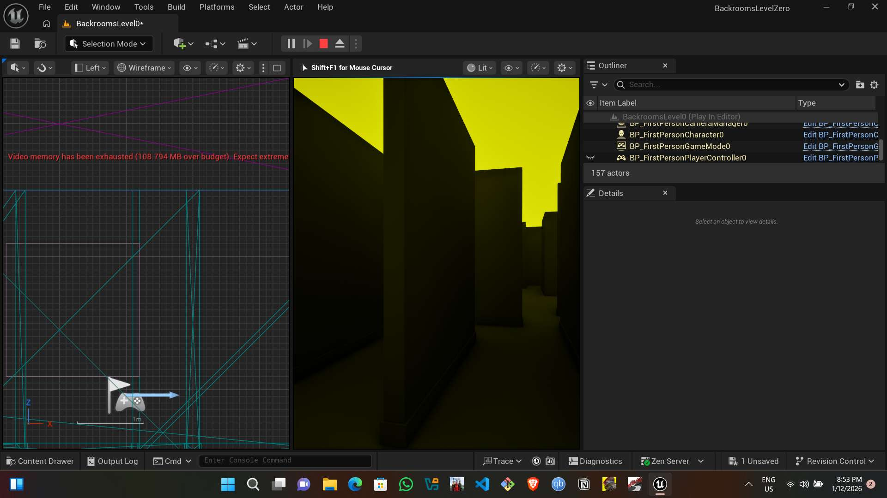

### **Adding Grid Texture to Ceiling**

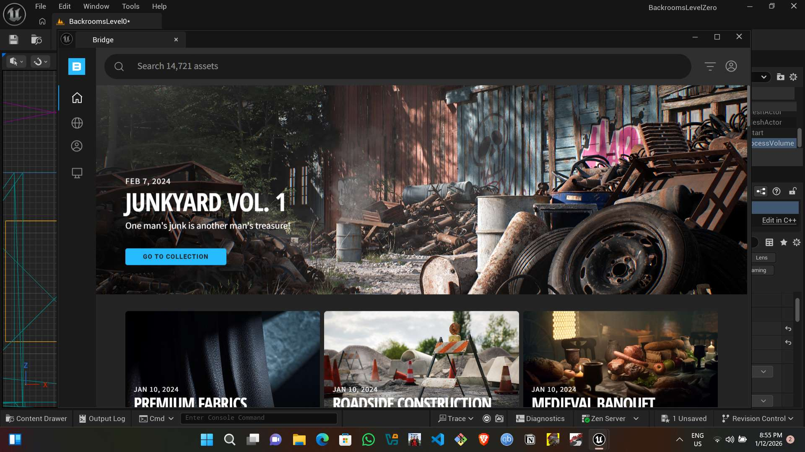

### **Using Quixel Bridge:**
- Go to Add menu → **Quixel Bridge**
- Must sign in with Epic Games account
- Search for: "square floor tiles"
- Find "Square Floor Tiles" texture
- Select **Medium** quality
- Click **Download**
- Click **Add**
- Creates folder: "MegaScan_Surfaces_SquareFloorTiles"
- Contains texture files and material

### **Applying Texture:**
- Close Bridge
- Open "M_BackroomCeiling" material
- From content browser, drag "SquareFloorTiles" texture ending in "_D" (diffuse/color)
- Place in material graph
- Close content browser window

### **Basic Texture Application:**
- Take **RGB** output from texture
- Plug into **Emissive Color**
- Save
- Check level - ceiling now has tiled pattern

### **Adjusting Tile Scale:**
- In material, click empty space
- Press **U** + left-click (creates Texture Coordinate)
- Drag from Texture Coordinate output
- Press **asterisk (*)** or type "multiply"
- Creates Multiply node
- Connect multiply output to texture **UVs** input
- Set multiply value to **2**
- Doubles tile density (4x4 becomes 8x8)
- Save and check level

### **Further Scaling:**
- Change multiply value to **10**
- Save
- Creates denser tiling pattern in level

### **Adding Yellow Tint:**
- Take one channel from texture (example: **Red** channel)
- Drag out, type "multiply" or press asterisk
- Connect to multiply node
- Take yellow color output, connect to multiply
- Connect multiply output to Emissive Color
- This multiplies black/white pattern by yellow color
- Adjust yellow brightness:
  - Double-click yellow color node
  - Change **Value** from 1 back to **0.05**
  - Creates darker, tinted grid
- Save

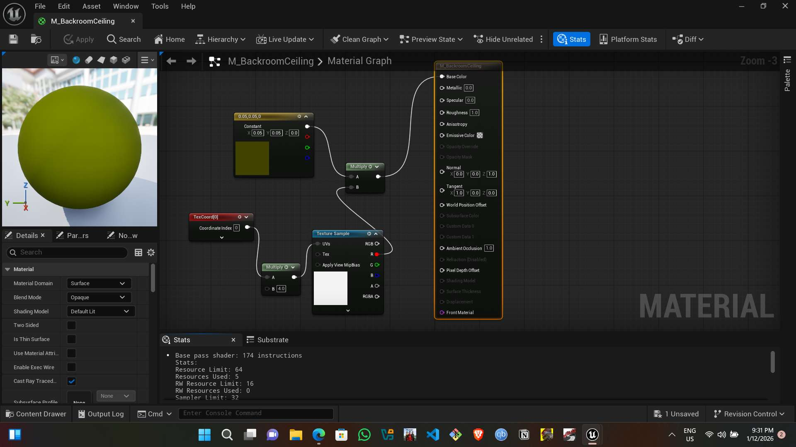

### **Adjusting Exposure:**
- Lighting may be too dark now
- Will adjust after adding ceiling lights

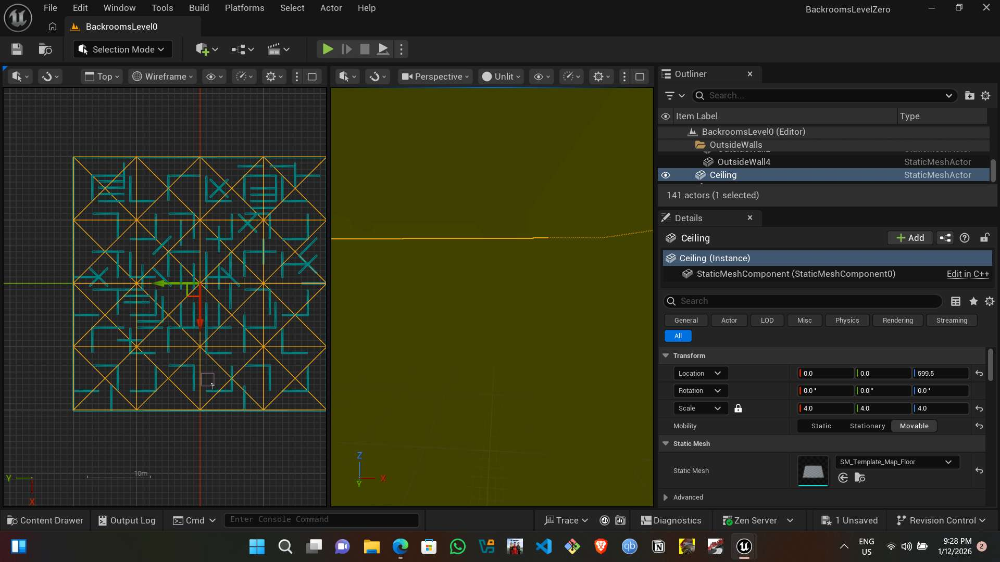

---

## **CREATING CEILING LIGHTS**

### **Creating Light Material**

### **New Material:**
- Press Ctrl+Space for content browser
- Go to Materials folder
- Right-click → New Material
- Name: "M_CeilingLight"
- Double-click to open
- Drag to top of screen

### **Setting Up White Emissive:**
- Click empty space
- Press **3** + left-click (color node)
- Default is black - double-click
- Set RGB to **1, 1, 1** (pure white)
- Connect to **Emissive Color**
- Save material

### **Creating Light Cube**

### **Adding Cube:**
- Go to Add menu → **Shapes**
- Drag **Cube** into scene
- Position half in ceiling
- Apply light material:
  - In Details → Materials
  - Type "ceiling"
  - Select "M_CeilingLight"
  - Cube lights up

### **Positioning Cube:**
- Change snapping to **10** for fine control
- Drag cube on blue (Z) axis
- Move up into ceiling
- Drag down one snap (10cm sticking out)

### **Centering Cube:**
- In Details → Transform → Location
- Set X and Y to **0**
- Centers cube in room

### **Renaming:**
- Select cube in outliner
- Press F2
- Rename: "CeilingLight"

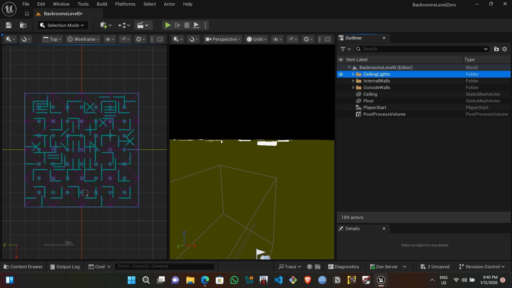

### **Distributing Lights**

### **Setting Up Views:**
- Click top right for two-panel view
- Set left panel to **Top** view
- Cube shows in center of room

### **Creating Light Grid:**
- Change snapping to **100** (1 meter)
- Select ceiling light
- Hold **Alt** + drag to duplicate
- Place between groups of walls
- Continue duplicating across row
- Select first light, shift+select last in row
- Hold Alt + drag entire row down
- Repeat for top row
- Creates grid of 49 lights (7x7)

### **Organizing:**
- In outliner, select first CeilingLight
- Shift+select last CeilingLight
- Right-click → Move to Create New Folder
- Name: "CeilingLights"
- Collapse folder

### **Adjusting Ceiling Material:**
- Click restore viewport (single view)
- Scene appears underexposed
- Open "M_BackroomCeiling" material
- Hold **Ctrl** + drag color node
- Move from Emissive Color to **Base Color**
- Now ceiling reacts to light instead of emitting
- Save
- Room now completely dark except cube lights

### **Adjusting Exposure:**
- Select Post Process Volume in outliner
- Go to Exposure settings
- Change Exposure Compensation from 10 to **20**
- Too bright
- Reduce to **15**
- Still too bright
- Try **12.5** or **13**
- Adjust as needed for desired look

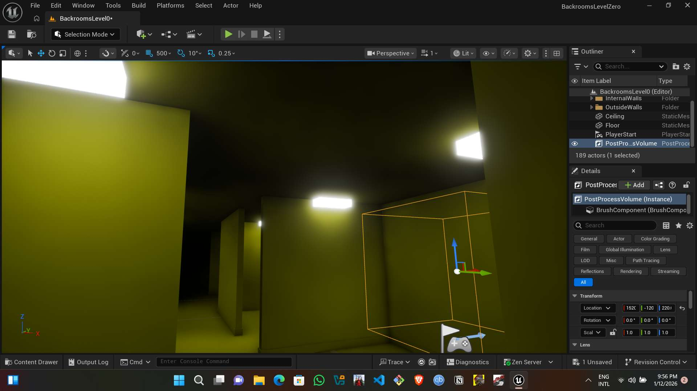

---

## **CREATING CARPET MATERIAL**

### **Duplicating Base Material:**
- Save project
- Press Ctrl+Space for content browser
- Navigate to Materials folder
- Select "M_BackroomYellow"
- Press **Ctrl+D** to duplicate
- Rename: "M_BackroomCarpet"
- Double-click to open
- Drag to top of screen

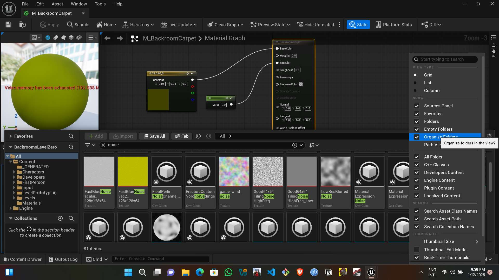

### **Current State:**
- Has solid murky yellow color
- Want to add weaved wool carpet texture

### **Adding Noise Texture:**
- In content browser, go to **All**
- Search for "noise"
- Shows various noise textures
- If none visible:
  - Click Settings
  - Check "Show Engine Content"
  - Check "Show Plugin Content"
- Select "Good_64x64_TilingNoise"
- Drag into material graph

### **Testing Noise:**
- Connect texture RGB to Base Color
- Save
- Black and white noise pattern

### **Applying to Floor:**
- Select Floor in outliner
- In Details → Materials
- Change from M_BackroomYellow to **M_BackroomCarpet**
- Floor shows black/white noise

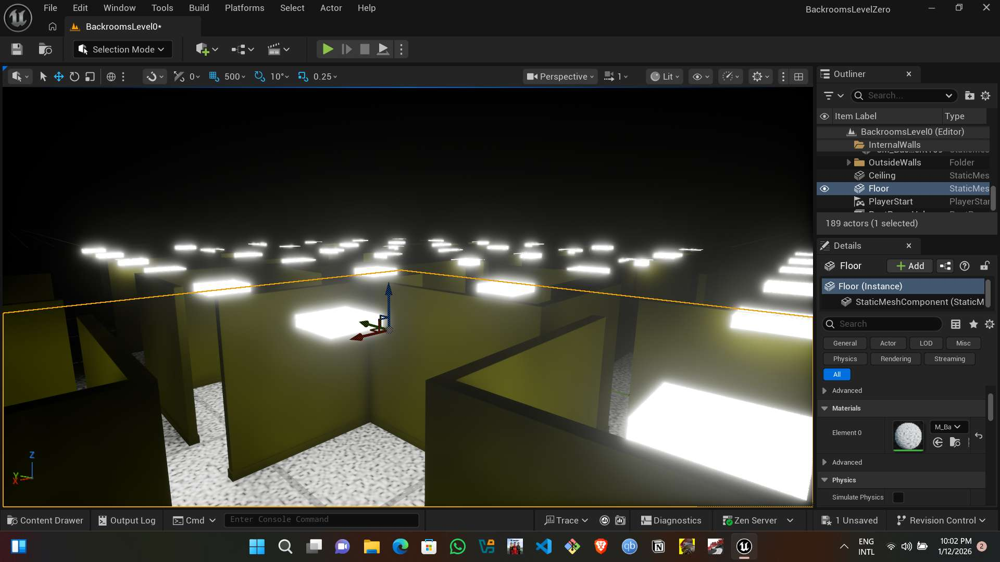

### **Adjusting Tile Density:**
- Press **G** to toggle grid/game view
- In material, click empty space
- Press **U** + left-click (Texture Coordinate)
- Drag out, create **Multiply** node
- Connect multiply to texture UVs
- Try value **100**
- Save - too dense
- Change to **20**
- Save - shows speckled look

### **Adding Yellow Color:**
- Drag from yellow color output
- Create **Multiply** node
- Connect noise texture to multiply
- Connect multiply output to Base Color
- Save
- Carpet now has roughness but still yellow

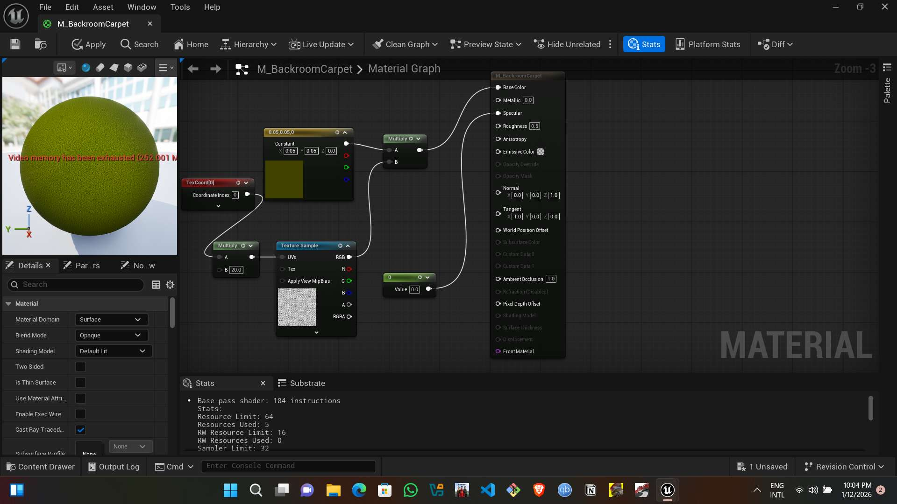

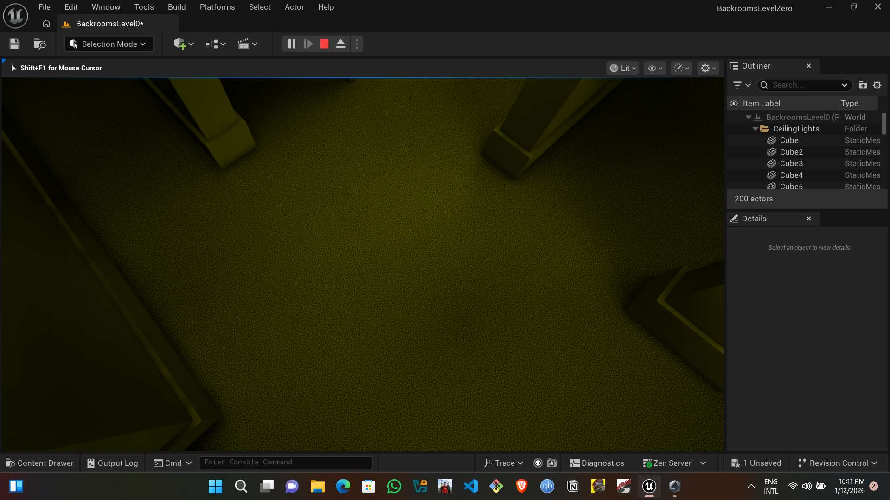

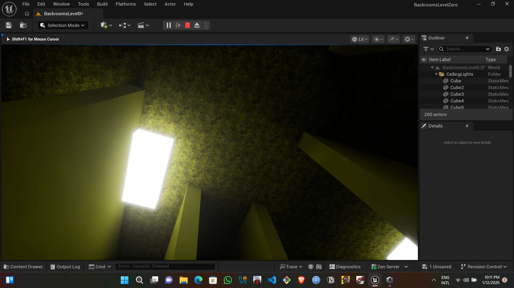

---

## **ADDING WALLPAPER TEXTURE**

### **Getting Wallpaper from Quixel Bridge**

### **Finding Texture:**
- Go to Add → **Quixel Bridge**
- Search for: "old decorative wallpaper"
- Find "Old Decorative Wallpaper" texture
- Select **Medium** quality
- Click Download
- Click Add
- Creates new folder in project
- Texture available in Megascan surfaces

### **Creating Wallpaper Material:**
- Close Bridge
- In Materials folder
- Select "M_BackroomYellow"
- Press Ctrl+D to duplicate
- Rename: "M_BackroomWallpaper"
- Open material

### **Setting Up Material:**
- Open content browser (Ctrl+Space)
- Navigate to wallpaper texture folder
- Drag texture ending in "_D" into material
- Can close content browser

### **Applying to Walls:**
- Drag material editor to side to see level
- Open InternalWalls folder
- Select first wall
- Shift+select last wall (all selected)
- In Details → Materials
- Element 0 (main wall): Change to M_BackroomWallpaper
- Element 1 (baseboard): Leave as M_BackroomYellow

### **Testing Basic Application:**
- Save project
- In material, take texture RGB
- Plug into Base Color
- Save
- Walls show wallpaper pattern

### **Adjusting Scale:**
- Pattern too large
- Click empty space
- Press **U** + left-click (Texture Coordinate)
- Create **Multiply** node
- Connect to texture UVs
- Try value **20**
- Save - close but too dense
- Change to **10**
- Save - better scale

### **Converting to Yellow:**
- Currently white/red/yellow pattern
- Want yellow only
- Take one channel from texture (example: **Red**)
- This gives black/white values (0 to 1)

### **Color Blending:**
- Duplicate yellow color (Ctrl+D)
- Double-click second yellow
- Change Value from 0.05 to **0.02** (darker yellow)
- Now have light yellow (0.05) and dark yellow (0.02)

### **Using Linear Interpolate (Lerp):**
- Drag from dark yellow color
- Type "lerp" or "linear interpolate"
- Creates Lerp node
- Connect dark yellow (0.02) to **A** input
- Connect light yellow (0.05) to **B** input
- Connect texture Red channel to **Alpha** input
- Connect Lerp output to Base Color
- Save

### **Result:**
- Wallpaper pattern visible
- Blends between dark and light yellow
- Black areas = darker yellow
- White areas = lighter yellow

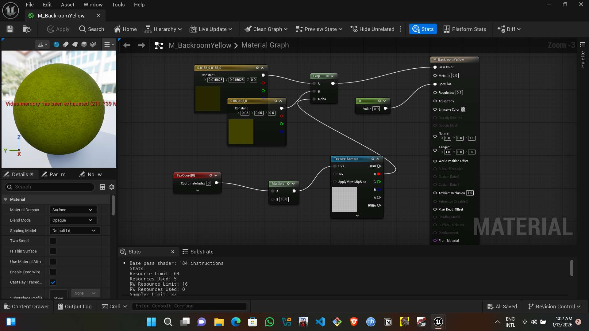

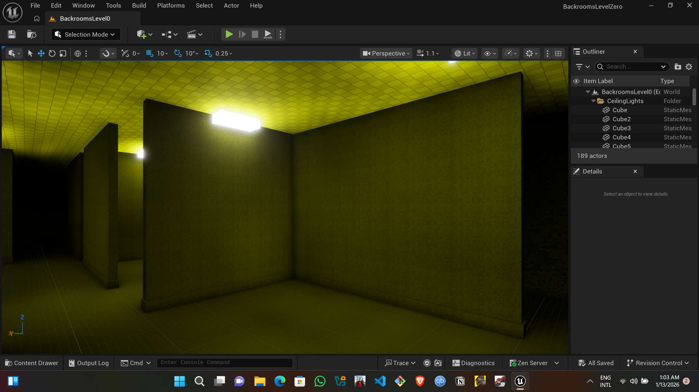

- did some tweaks with ceiling 

---

## **ADDING POST-PROCESSING EFFECTS**

### **Using Post Process Volume:**
- Select Post Process Volume in outliner
- Already created for exposure control
- Has many sections for different effects

### **Adjusting Bloom:**
- Find **Bloom** section
- Controls light "bleeding" effect
- Current intensity creates bloom around lights
- Can reduce **Intensity** to 0 (no bloom)
- Or set to **0.2** for slight bloom
- Adds to old camera effect

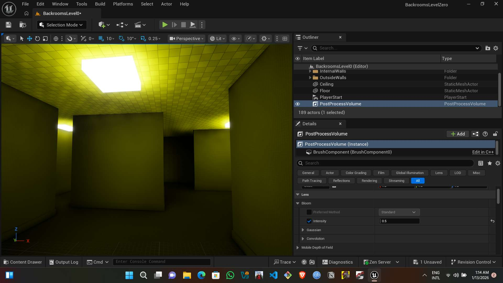

### **Chromatic Aberration:**
- Camera lens effect
- Separates RGB components like a prism
- Find **Chromatic Aberration** section
- Set **Intensity** to 10 - too much (red/green/blue separation visible)
- Reduce to **2** - still too much
- Set to **1** - subtle old lens effect

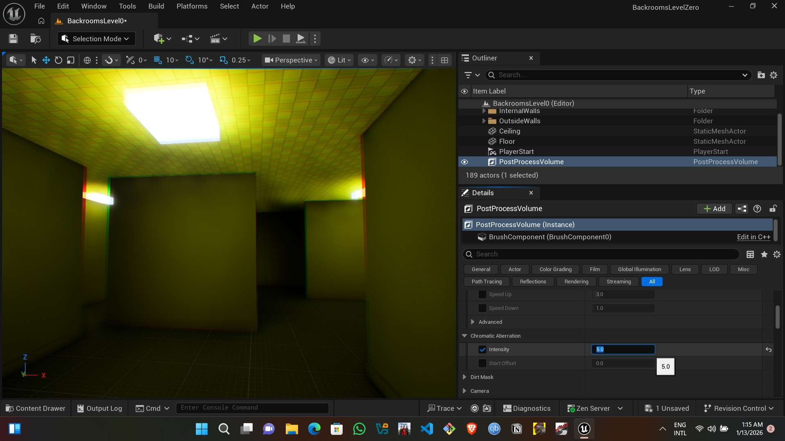

### **Lens Dirt Mask:**
- Adds dirt/water marks on lens
- Find **Dirt Mask** section
- Click **Dirt Mask Texture** dropdown
- Search for "dirt"
- Select "ScreenDirt" texture
- Nothing visible yet
- Set **Dirt Mask Intensity** to 10 - very visible watermarks
- Reduce to **2** or **3**
- Final setting: **2**
- Shows dirt especially near lights

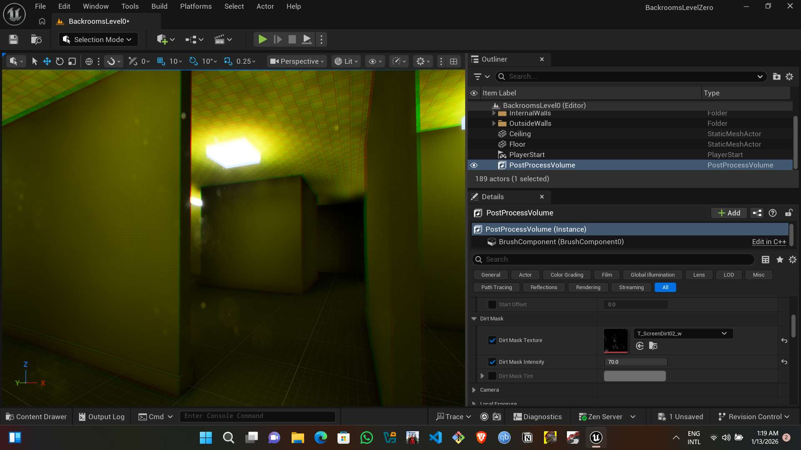

### **Film Grain:**
- Adds static/grain like old film
- Find **Film Grain** section (just over halfway down)
- Set **Intensity** to 10 - looks like TV static
- Reduce to **1** or **2** - subtle grain
- Final setting: **1.5**
- Adds grittiness to camera

**Note:**
- Can adjust these values later
- Creates authentic VHS/old camera look

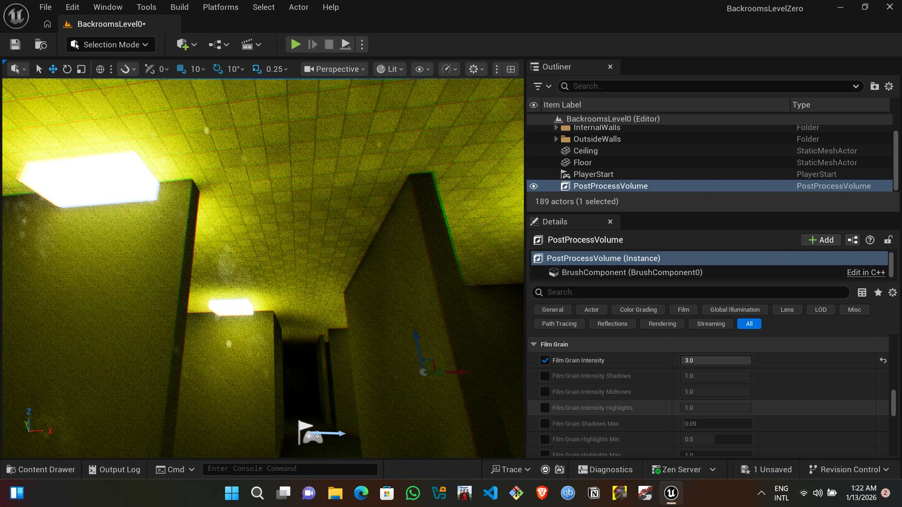

---

## **ADDING CAMERA SHAKE**

### **Purpose:**
- Add random gentle motion when standing still
- Simulates slight looking around
- Adds nervousness to scene

### **Creating Camera Shake Blueprint**

### **Steps:**
- Press Ctrl+Space for content browser
- Go to top level
- Right-click → Create Blueprint Class
- At bottom, click "Expand All Classes"
- Search for "shake"
- Select **MatineeCameraShake**
- Name: "BackroomCameraShake"

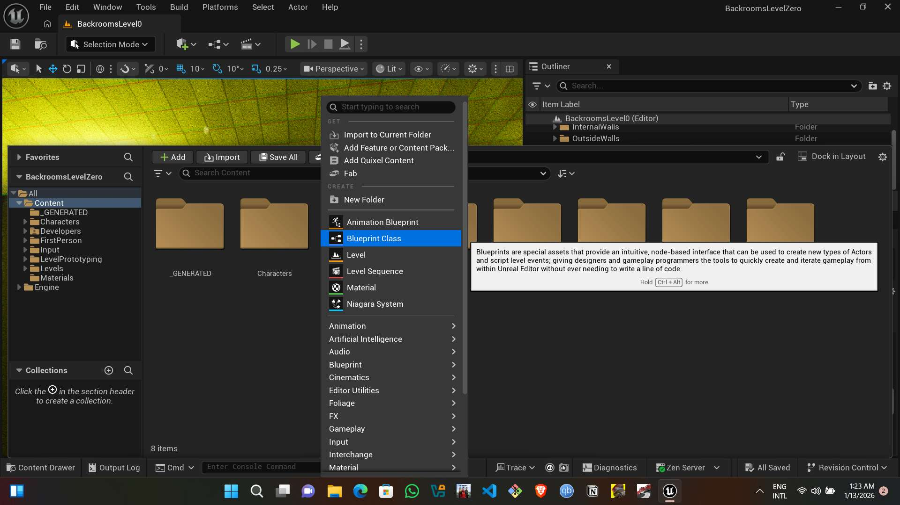

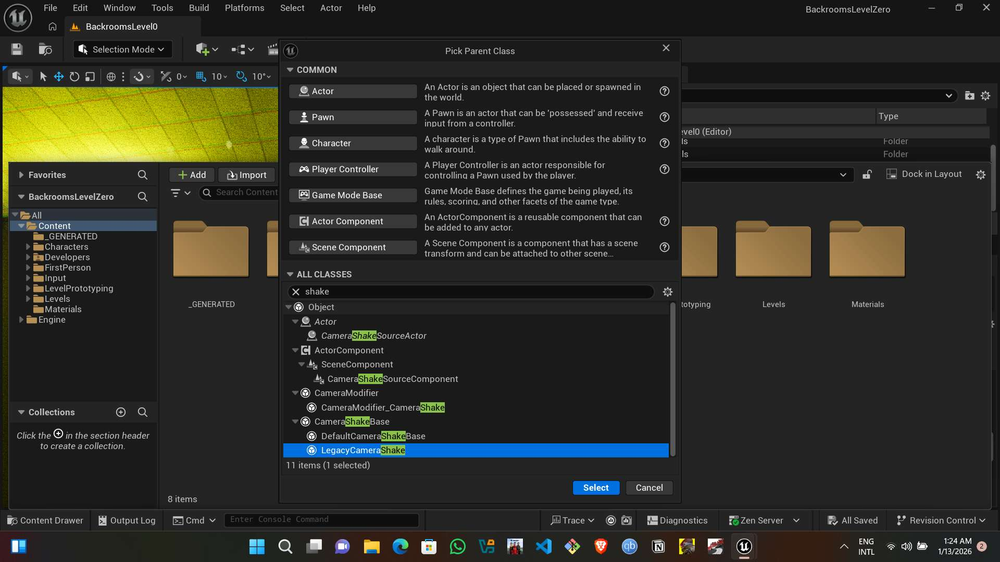

### **Configuring Camera Shake:**
- Double-click to open
- Place at top of screen
- Focus on Details panel on right

### **Setting Duration:**
- Find **Duration** setting
- Currently 0 (no shake)
- Enter **99999999999999999999999999999** (maximum value for continuous shake)

### **Setting Rotation Parameters:**
- Not interested in **Location** (don't want camera moving around)
- Focus on **Rotation** section:
  - **Pitch** (up and down):
    - **Amplitude**: 1
    - **Frequency**: 1
    - **Initial Offset**: Random Rotation Start
    - **Waveform**: Change from Sine to **Noise** (random movement)
  - **Yaw** (left and right):
    - **Amplitude**: 1
    - **Frequency**: 1
    - **Initial Offset**: Random Rotation Start
    - **Waveform**: Change from Sine to **Noise**
  - **Roll** (side to side):
    - Leave at 0 (looks drunk if enabled)

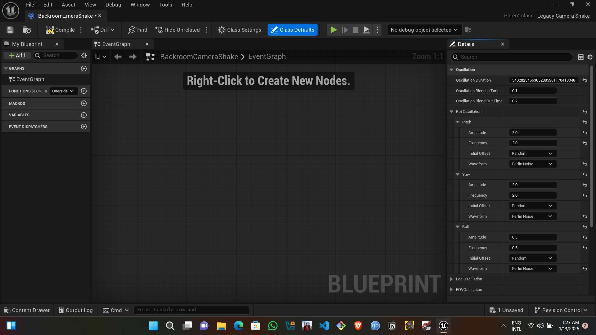

### **Saving:**
- Click **Compile**
- Click **Save**

### **Applying to First Person Camera**

### **Steps:**
- Go back to content browser (top level)
- Search for "first"
- Find "BP_FirstPersonCharacter"
- Open it
- Go to **Viewport** tab
- Select **Camera** component

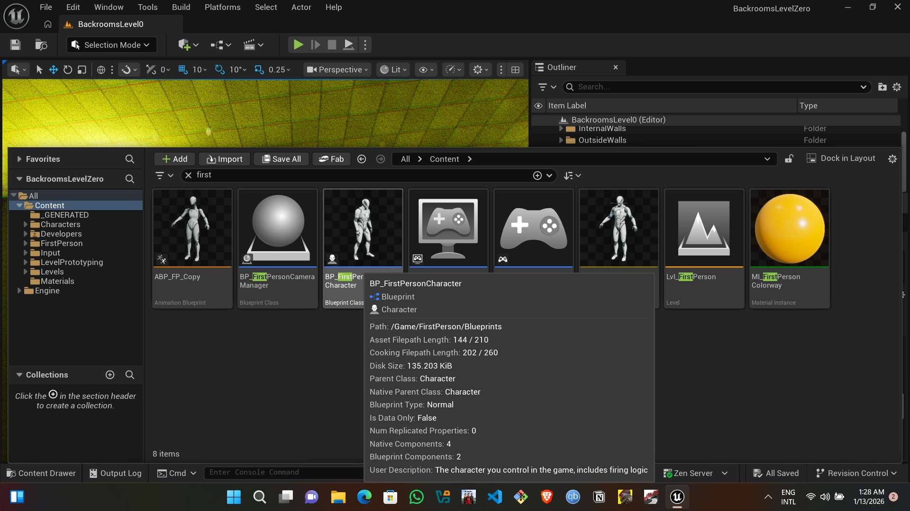

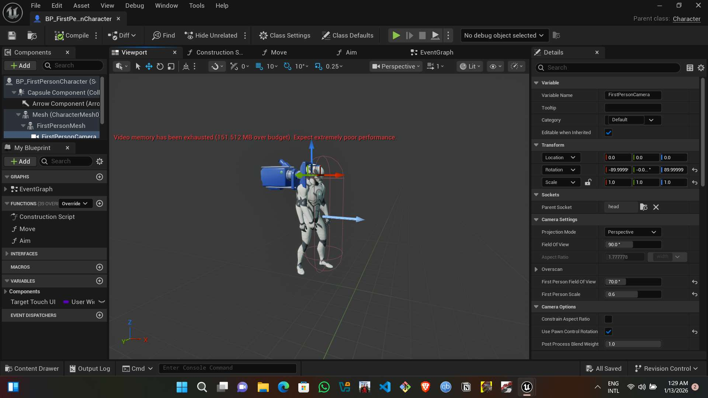

### **Adding Shake Component:**
- At top, click **Add**
- Type "shake"
- Select **Camera Shake Source** component
- Added under First Person Camera in hierarchy

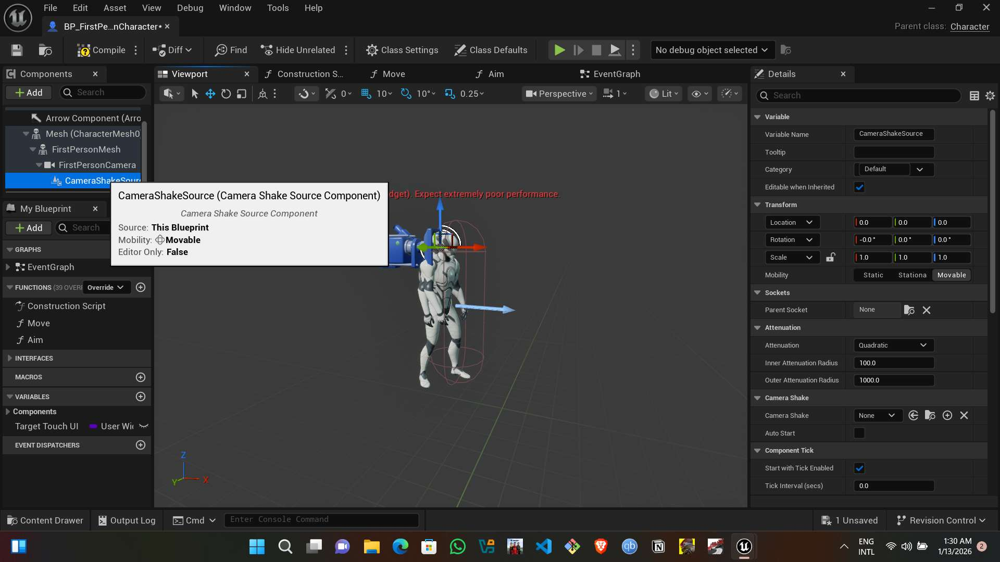

### **Configuring Shake Source:**
- Select Camera Shake Source
- In Details on right:
  - **Camera Shake** dropdown: Select "BackroomCameraShake"
  - Check **Auto Start** (already checked by default)
  - This starts shake when level loads

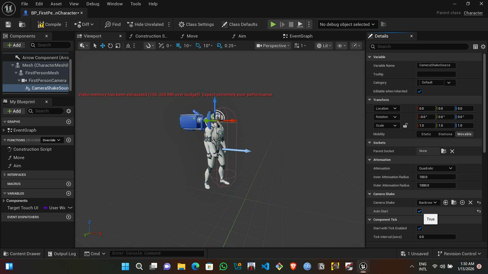

### **Testing:**
- Click **Compile**
- Click **Save**
- Leave blueprint open
- Click **Play**
- Camera gently moves left/right and up/down randomly
- Even when standing still
- Press Escape to exit

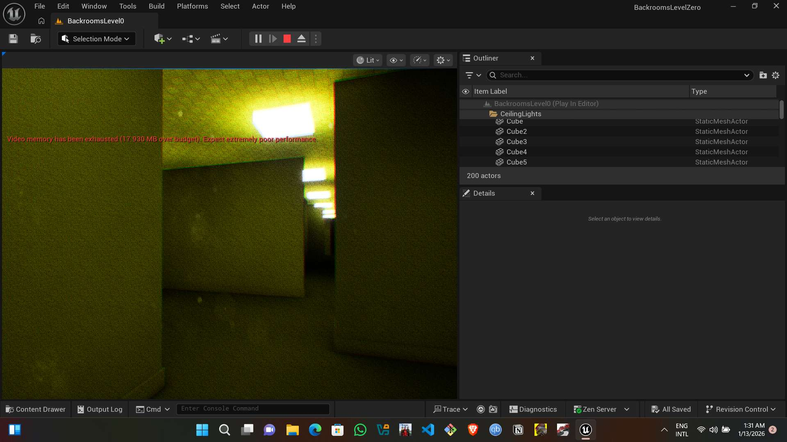

- Me Rn
  - 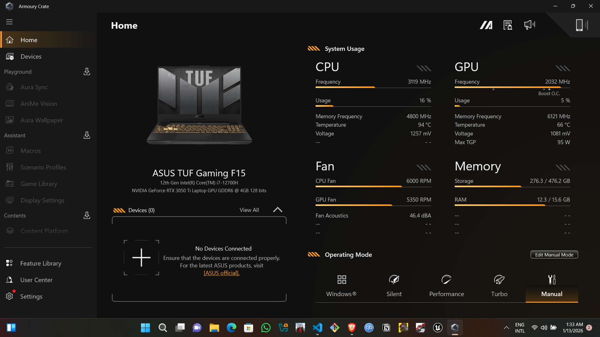

---

## **ADDING GRAFFITI DECAL**

### **Purpose:**
- Break up monotony of walls
- Add point of interest
- Keep room mostly repetitive but with one feature

### **Getting Graffiti from Quixel Bridge**

### **Finding Decal:**
- Go to Add menu → **Quixel Bridge**
- Section called **Decals**
- Contains blood splatters, graffiti, etc.
- Go to Graffiti section
- Search through options
- Example: "Who Is Here" graffiti tag
- Select any graffiti you prefer

### **Downloading:**
- Select graffiti
- Choose **Medium** quality
- Click **Download**
- Click **Add**
- Creates folder: "MegaScans_Decals" subfolder
- Close Bridge

### **Applying Graffiti**

### **Dragging Decal:**
- Navigate viewport to desired wall
- Example: End wall
- From content browser, drag **Material Instance** (graffiti)
- Drop onto wall
- Will appear in wrong orientation (don't worry)
- Close content browser

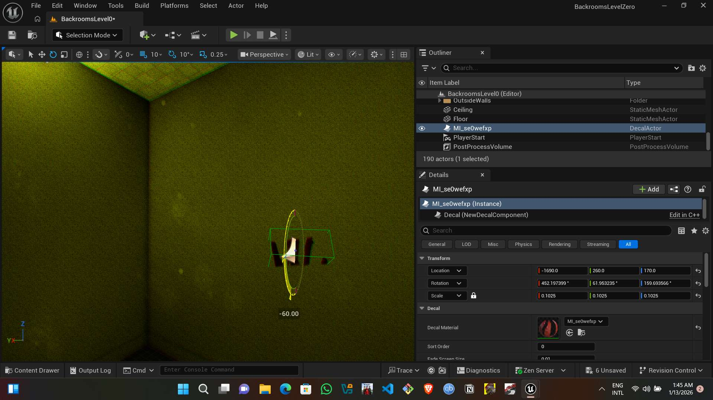

### **Rotating Decal:**
- Decals project onto surfaces from just in front
- Press **E** for rotation tool
- Try different axes:
  - Z-axis rotation
  - Y-axis rotation
  - X-axis rotation
- Rotate 90 degrees until correct orientation
- If upside down, rotate again

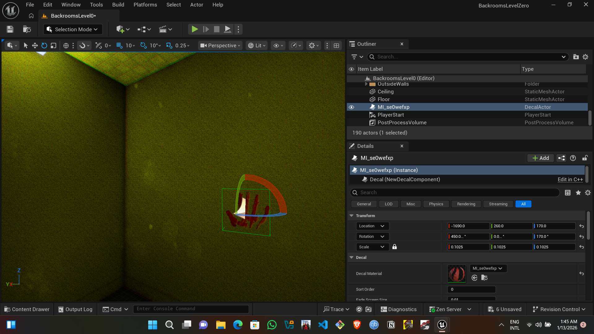

### **Scaling Decal:**
- Press **R** for scale tool
- With middle handle selected, drag in/out
- Scale down to fit on wall

### **Positioning:**
- Press **W** for move tool
- Move to desired position on wall

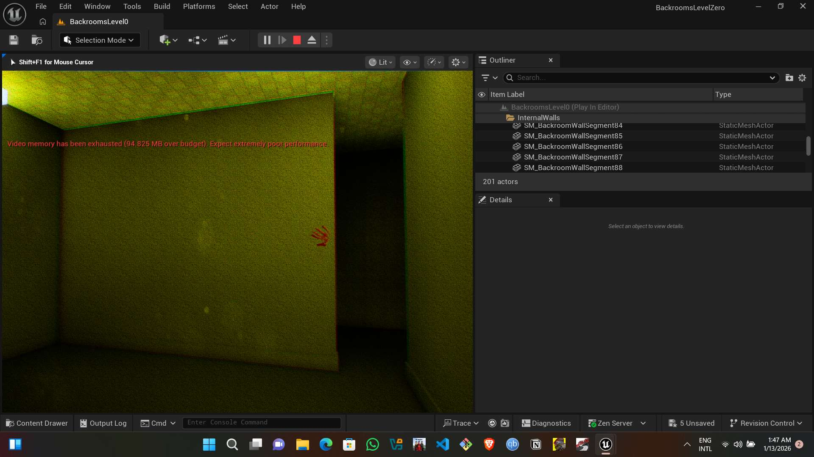

### **Modifying Decal Appearance**

### **Adjusting Opacity:**
- Save project
- Select graffiti in outliner
- In Details, find **Decal Material**
- Click arrow to browse to it
- Double-click to open material instance

### **Changing Settings:**
- Various settings available:
  - Metallic
  - Roughness
  - Opacity Intensity
- Find **Opacity Intensity**
- Current value: 1 (fully opaque)
- Try **0** - completely invisible
- Try **0.5** - half transparent
- Try **0.1** or **0.2** - shows yellow through paint
- Recommended: **0.1**
- Save and close
- Graffiti now appears painted on wall with yellow showing through

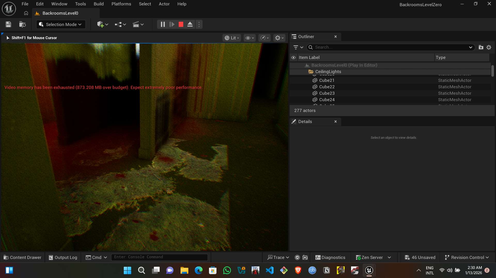

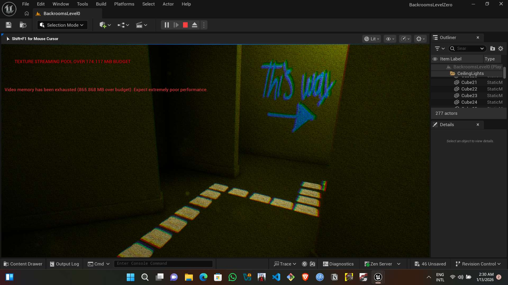

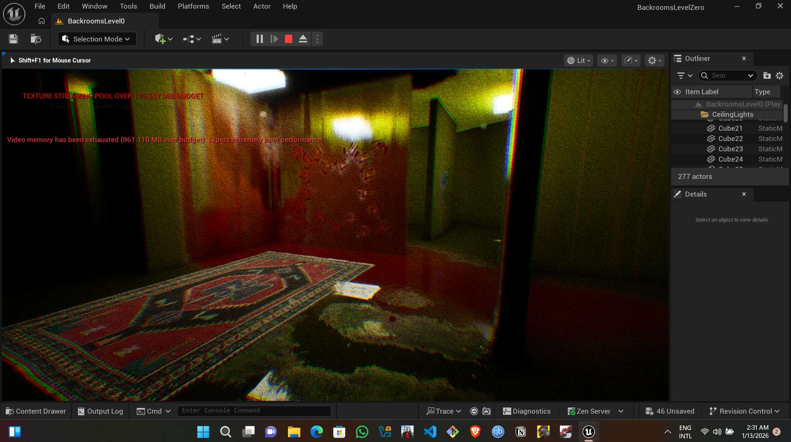

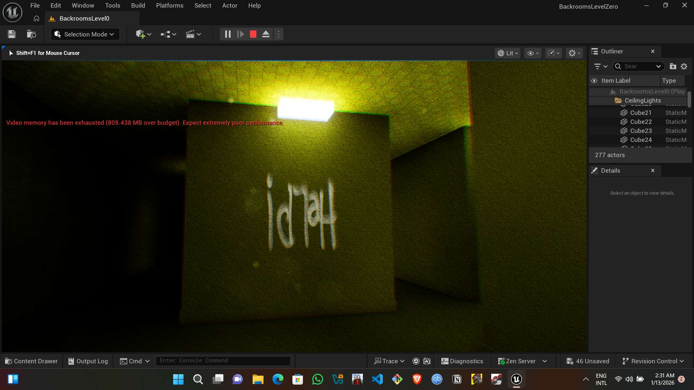

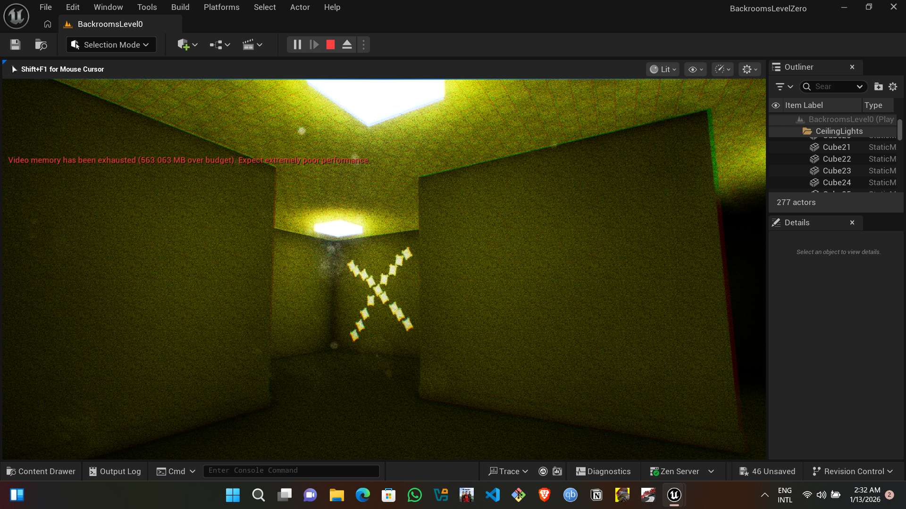

---

## **ADDING AUDIO**

### **Two Audio Components Needed:**
1. VHS static sound - plays throughout level
2. Eerie cool sound - triggers near graffiti

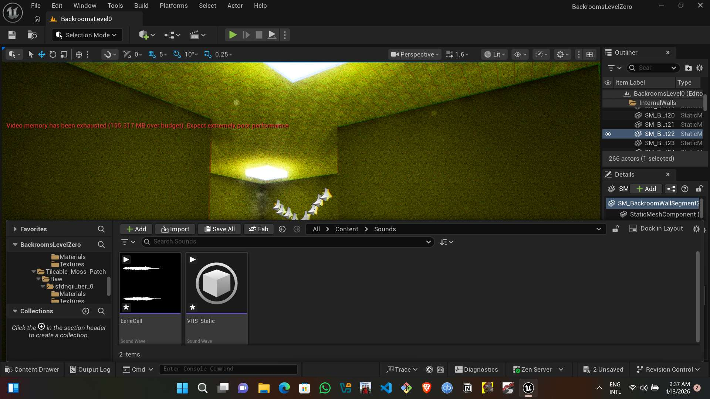

### **Preparing Sound Files**

### **File Requirements:**
- Proper format needed (example: 16-bit WAV file)
- Can find on freesound.org or create own
- Tutorial provides two edited sounds via Google Drive link (see description)

### **Importing Sounds:**
- Press Ctrl+Space for content browser
- Go to top level
- Right-click → Create New Folder: "Sounds"
- Enter Sounds folder
- Open Windows Explorer with downloaded WAV files
- Select both WAV files
- Drag into Sounds folder in Unreal
- Imports both files

### **Previewing Sounds:**
- Click sound file to play preview
- VHS static sound: Long looping sound
- Eerie sound: Distant atmospheric sound

### **Setting Up Looping:**
- Double-click "VHS_Static" sound
- Check **Looping** flag is ON
- Ensures sound continues throughout game
- Close sound editor

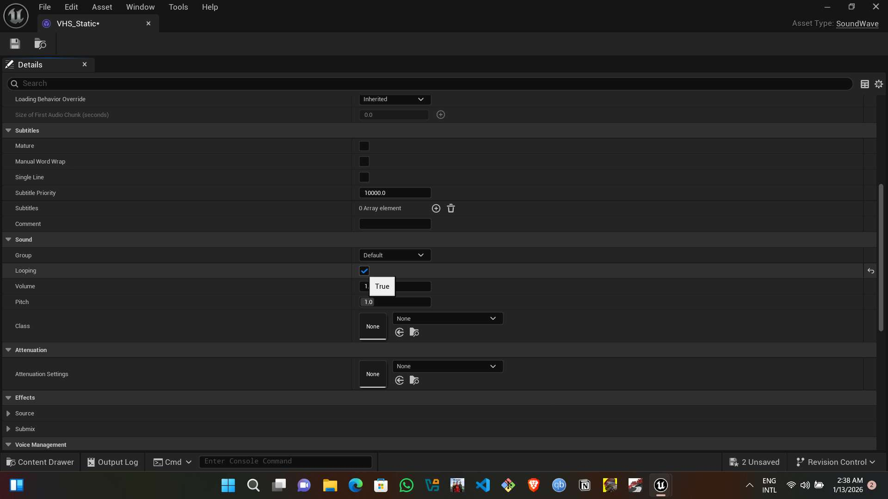

### **Adding VHS Static Sound to Player**

### **Steps:**
- Press Ctrl+Space for content browser
- Go to top level
- Search for "first"
- Find "BP_FirstPersonCharacter"
- Open it
- Go to **Viewport** tab

### **Adding Audio Component:**
- At top left, click **Add**
- Type "audio"
- Select **Audio** component
- Added under First Person Camera hierarchy
- Rename to "VHS_Audio" (optional)

### **Configuring Audio:**
- Select VHS_Audio component
- In Details on right:
  - **Sound** dropdown: Type "vhs"
  - Select "VHS_Static" sound
- Check **Auto Activate**:
  - Should be checked by default
  - Means sound starts when level loads
  - Combined with looping flag, plays continuously

### **Testing:**
- Click **Compile**
- Click **Save**
- Keep blueprint open
- Click **Play**
- VHS static sound plays immediately
- Press Escape to exit

### **Creating Trigger Box for Eerie Sound**

### **Creating Blueprint:**
- Press Ctrl+Space for content browser
- Make sure in Sounds folder
- Clear any search filters
- Right-click → Create Blueprint Class
- Select **Actor**
- Name: "BP_SoundTrigger"
- Double-click to open
- Drag to top of screen

### **Adding Box Collision:**
- Click **Add** (top left)
- Search for "box"
- Select **Box Collision**
- Box appears - this triggers the sound

### **Adding Audio Component:**
- Click **Add** again
- Type "audio"
- Select **Audio** component
- Appears in hierarchy

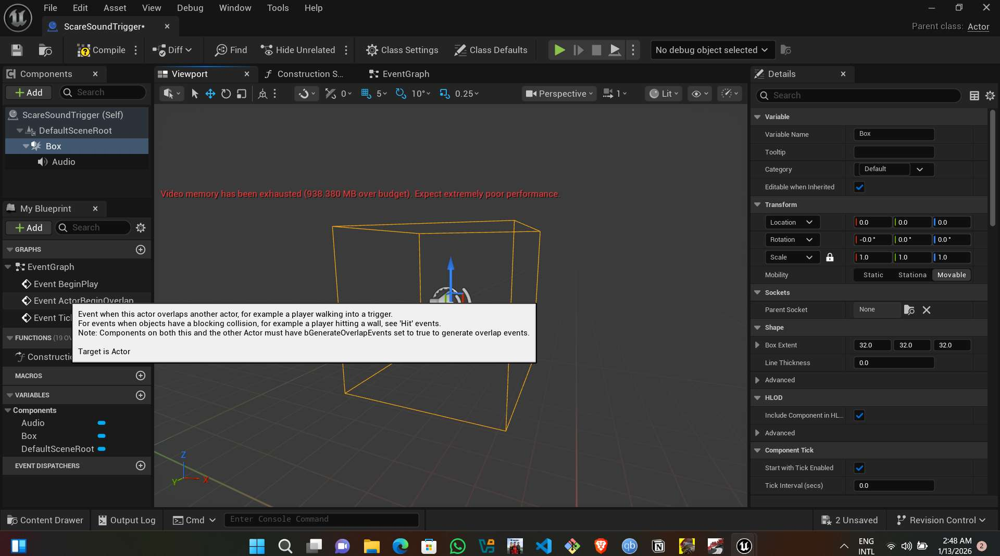

### **Setting Sound:**
- Select Audio component
- In Details → Sound dropdown
- Search for "eerie"
- Select eerie sound file
- Check **Auto Activate** is **UNCHECKED**
- Want sound to trigger only when entering box, not at level start

### **Setting Up Trigger Logic:**
- Select Box Collision component
- In Details, find **Events** section
- Double-click **Event Begin Overlap**
- Creates event node in Event Graph
- This fires when another actor (player) enters box

### **Connecting Audio:**
- Drag from Event Begin Overlap output
- Type "play audio"
- Select "Play (Audio)" - recognizes Audio component
- Automatically connects to Audio component in blueprint

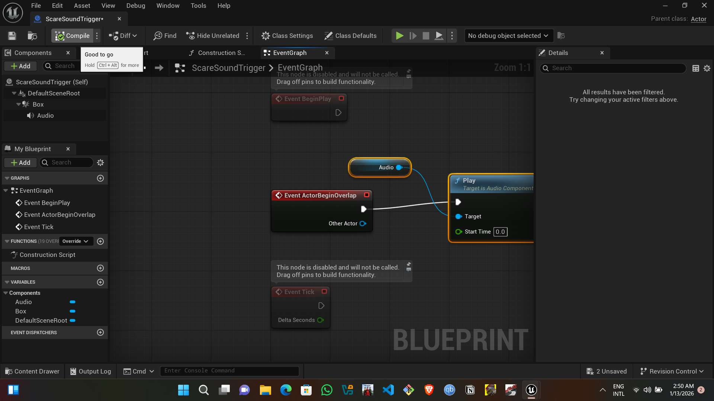

### **Result:**
- When player enters box, sound plays
- Click **Compile**
- Click **Save**

### **Placing Trigger in Level**

### **Steps:**
- Navigate to graffiti location in viewport
- From content browser, drag BP_SoundTrigger into scene
- Drop near graffiti wall
- If can't see box:
  - Press **G** to toggle game view on/off
  - Shows editor elements including trigger box

### **Positioning Trigger:**
- Set position snapping to 50 or lower for fine control
- Press **W** for move tool
- Move box in front of graffiti
- Box might be too small initially

### **Scaling Trigger:**
- Press **R** for scale tool
- Scale up to **3x** size
- Creates larger trigger area in corner
- When player enters this area, eerie sound plays

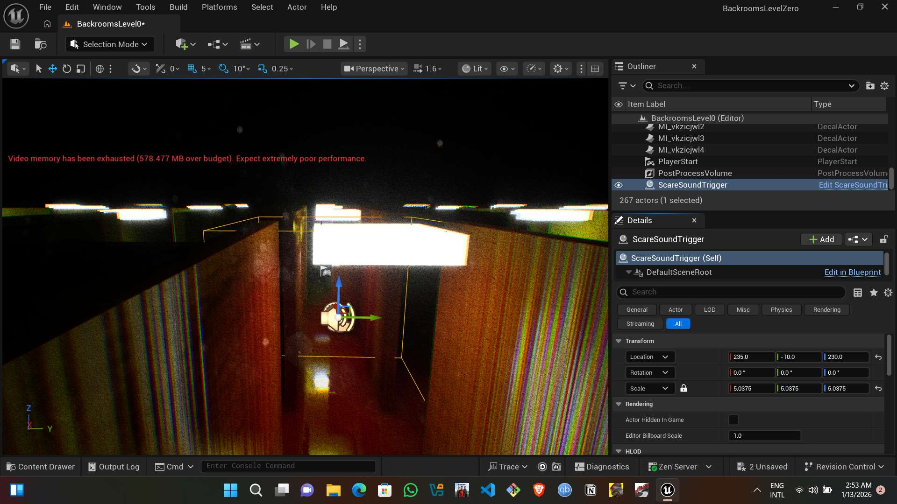

### **Testing:**
- Save project
- Click **Play**
- VHS static plays immediately
- Walk toward graffiti corner
- Eerie sound plays when entering trigger area
- Walk away - sound stops
- Return to corner - sound plays again
- Press Escape to exit

### **Full Screen Mode:**
- In play mode, select viewport
- Press **F11** for full screen
- See level in full glory
- Press F11 again to exit full screen

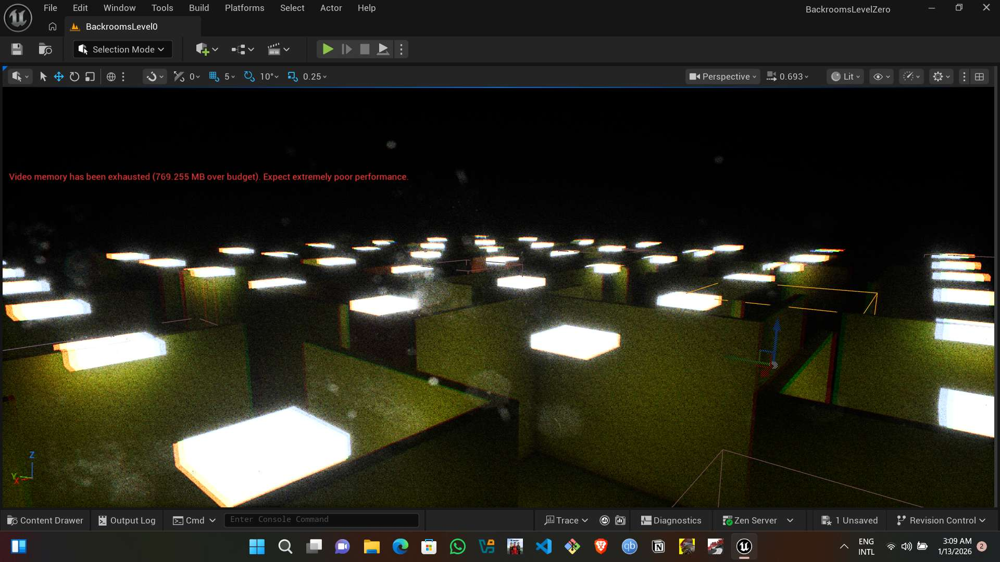

## **FISHEYE EFFECT**

### **Initial Setup**

### **Creating the Material**

- Press **Control + Space** to open the content browser
- Navigate to your desired folder location
- Right-click and select **Create a Material**
- Name the material: **PP_fisheye** (PP stands for post-process)
- Open the newly created material

### **Configuring Material Domain**

- In the left panel, locate **Material Domain** settings
- Change the domain from **Surface** to **Post Process**
- This conversion leaves only the **Emissive Color** output
- This configuration ensures the material functions as a post-process material

### **Building the Material Graph**

**Step 1: Screen Position Setup**

- Navigate to an empty space on the left side of the graph
- Right-click and add a **Screen Position** node
- This node provides viewport UV coordinates through its output

**Step 2: Component Mask Configuration**

- Add a **Component Mask** node
- Connect the Screen Position output to the Component Mask input
- In the Component Mask settings, ensure only **R (Red)** and **G (Green)** channels are ticked
- This isolates the necessary UV components

**Step 3: Addition Node Setup**

- Create an **Add** (Addition) node
- Connect the Component Mask output to input **A** of the Add node
- For input **B**, create a constant value:
  - Hold **1** key and left-click to create a **Constant** node
  - Set the constant value to **-0.5**
  - Connect this to input **B** of the Add node
- This operation centers the screen position
- Select this node group and press **C** to create a comment box
- Name the comment: **Screen Position Center**

**Step 4: Radial Gradient Configuration**

- From the Add node output, connect to a **Radial Gradient Exponential** node
- Create another constant value (hold **1** and left-click)
- Set this constant to **0** (zero)
- Connect it to the **Center Position V2** input

**Step 5: Radius Parameter**

- Hold **S** and left-click to create a **Scalar Parameter**
- Name this parameter: **Area Radius**
- Set default value to **1**
- Connect to the **Radius** input of the Radial Gradient Exponential node

**Step 6: Density Parameter**

- Hold **S** and left-click to create another **Scalar Parameter**
- Name this parameter: **Area Fall Off**
- Set default value to **1**
- Connect to the **Density** input of the Radial Gradient Exponential node
- Apply these changes

**Step 7: Invert Switch Setup**

- From the Radial Gradient Exponential output, add a **1 Minus** (One Minus X) node
- Right-click and search for **Switch Parameter**
- Name this parameter: **Invert**
- Connect the **1 Minus** output to the **True** input
- Connect the **Radial Gradient Exponential** output directly to the **False** input
- This creates an invertible radial falloff effect
- Select this section and press **C** to comment
- This represents the radial falloff from the screen center

**Step 8: First Multiplication**

- Move the nodes to the left for better organization
- From the Invert output, create a **Multiply** node (hold **M** and left-click)
- Connect the **Invert** output to input **B**
- Connect the **Addition** node (screen center position) to input **A**
- This multiplies the screen center position by the radial falloff

**Step 9: Intensity Parameter and Second Multiplication**

- Create another **Multiply** node (hold **M** and left-click)
- Connect the previous Multiply output to input **B**
- For input **A**, create a **Scalar Parameter** (hold **S** and left-click)
- Name this parameter: **Intensity**
- Set default value to **0.5**
- Connect to input **A** of the second Multiply node

**Step 10: Subtraction Setup**

- Add a **Subtract** node
- Connect the second Multiply output to input **B** of the Subtract node
- Connect the **Component Mask** output (from the Screen Position section) to input **A**
- This subtracts the multiplication result from the original screen position
- Double-click to create routing nodes for clean organization

**Step 11: Final Scene Texture Connection**

- From the Subtract output, add a **Scene Texture** node
- Set the **Scene Texture ID** to **Post Process Input 0**
- This ensures the material recognizes itself as a post-process effect
- Connect the **Color** output to the **Emissive Color** pin on the main material node
- Click **Apply** and **Save**

### **Creating Material Instance**

**Instance Setup**

- In the content browser, right-click on the fisheye material
- Select **Create Material Instance**
- Open the material instance

**Available Parameters**

The material instance provides adjustable parameters:

- **Invert**: Toggles the direction of the post-process effect
- **Intensity**: Controls the strength of the fisheye distortion
- **Area Radius**: Adjusts the size of the affected area
- **Area Fall Off**: Controls how gradually the effect fades

All values can be modified in real-time for customization

### **Implementing in Scene**

**Post Process Volume Setup**

- Search for **Post Process Volume** in the scene
- If not present, click **Quick Add** button and search for **Post Process Volume**
- Add the Post Process Volume to the scene
- Select the Post Process Volume

**Volume Configuration**

- Enable **Infinite Extent** (or **Unbound**) option
- This applies the effect to the entire map, not just within the volume bounds

**Adding the Material**

- In the Post Process Volume settings, search for **Materials**
- Expand **Post Process Materials**
- Click **Add Array Element** (the plus icon)
- Choose **Asset Reference**
- Select **PP_fisheye** (the material instance version)

### **Testing and Customization**

**In-Editor Preview**

The fisheye lens effect is now visible in the viewport and can be adjusted through the Post Process Volume settings.

**Parameter Adjustment Examples**

- **Invert**: Changes the curvature direction of the distortion
- **Intensity**: Increases or decreases distortion strength
- **Radius**: Expands or contracts the affected area
- **Fall Off**: Softens or sharpens the transition

### **Gameplay Testing**

When hitting play, the body cam system displays the fisheye lens effect, creating a more realistic body camera appearance. The effect enhances visual authenticity for body cam perspectives.

**Use Cases**

- Body camera systems
- Security camera footage
- Wide-angle camera effects
- Any scenario requiring lens distortion effects
- Custom camera perspectives

**Key Advantages**

- Fully customizable parameters
- Real-time adjustable values through material instance
- Works with any camera or viewport
- Non-destructive post-process implementation
- Performance-efficient material setup

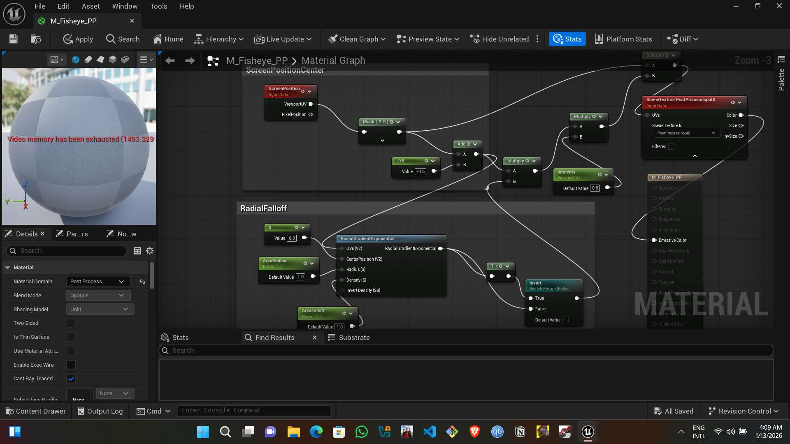
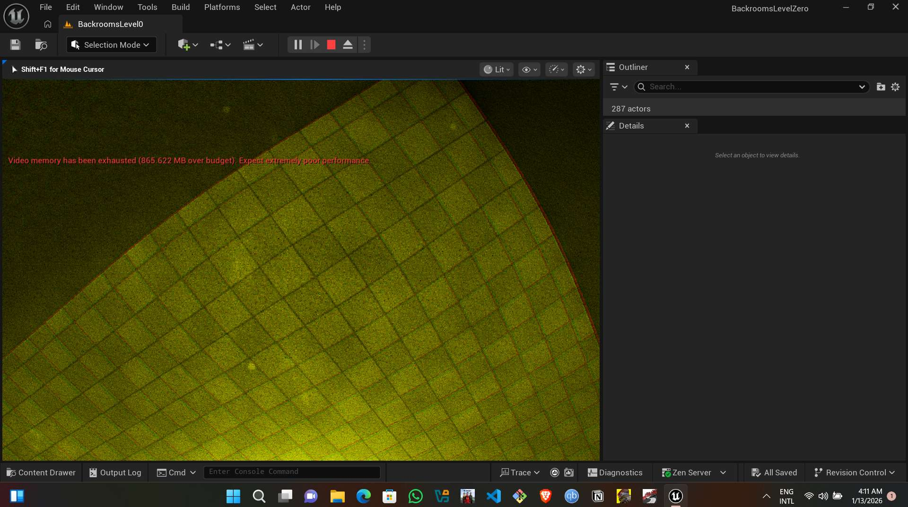
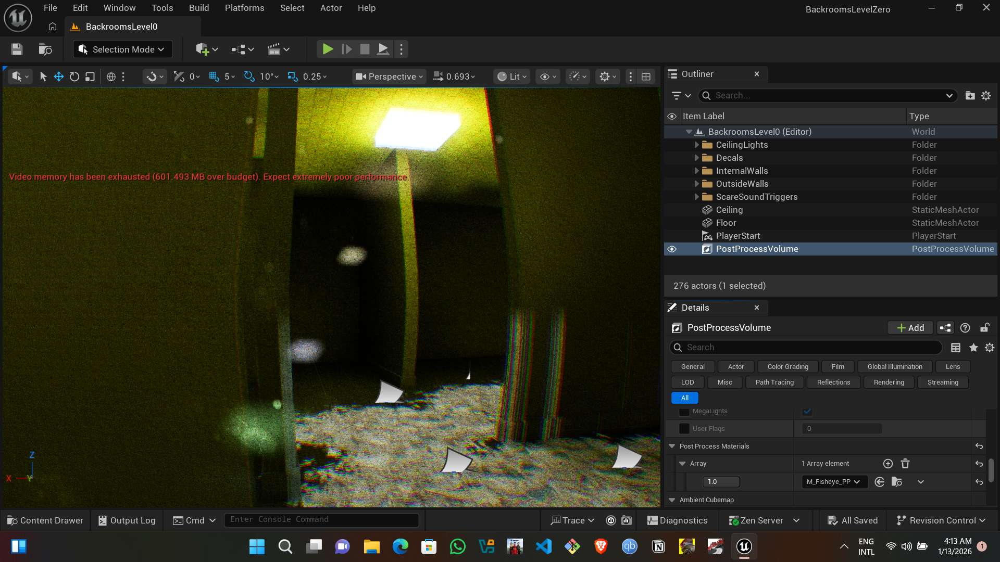
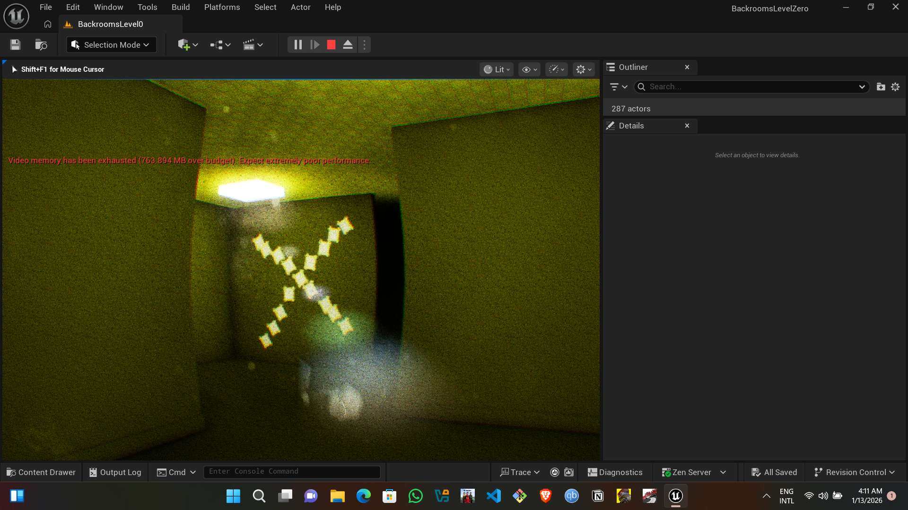

---

## **FIX WALL COLLISION**

* Select a wall in the level
* Right-click → **Browse to Asset**
* Double-click the wall mesh (opens Static Mesh Editor)
* Top menu → **Collision**
* Click **Show Collision**
* If you see NO green lines → collision is missing
* Click **Collision → Add Box Simplified Collision**
  * (or **Add Convex Collision**)
* Make sure green collision appears
* **Save** the mesh
* Go back to level
* Press **Play**
* Player should now **stop at walls**
* In viewport press **Alt + C**
* Green outlines = collision working
* `BlockAll` alone is NOT enough
* Mesh MUST have collision geometry

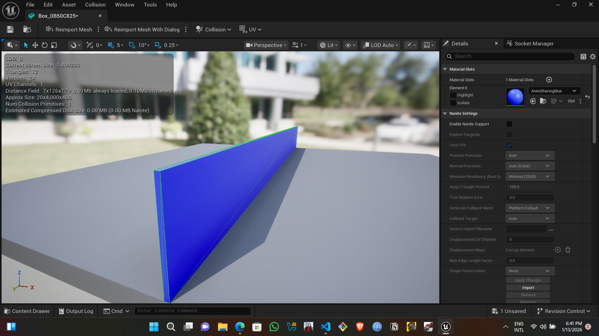
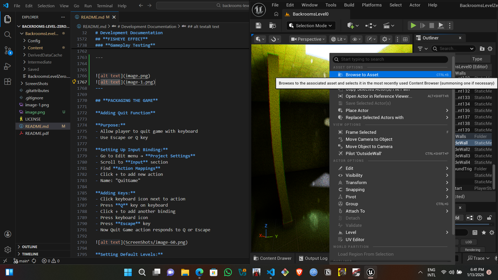
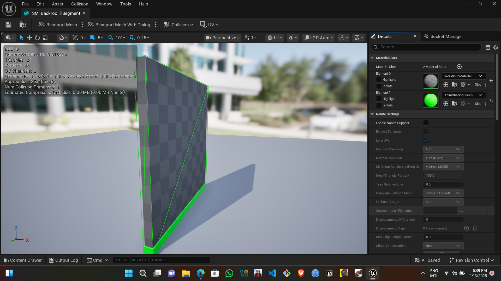

---

## **PACKAGING THE GAME**

**Adding Quit Function**

**Purpose:**
- Allow player to quit game with keyboard
- Use Escape or Q key

**Setting Up Input Binding:**
- Go to Edit menu → **Project Settings**
- Scroll to **Input** section
- Find **Action Mappings**
- Click + to add new action
- Name: "QuitGame"

**Adding Keys:**
- Click keyboard icon next to action
- Press **Q** key on keyboard
- Click + to add another binding
- Press keyboard icon
- Press **Escape** key
- Now Quit Game action responds to Q or Escape

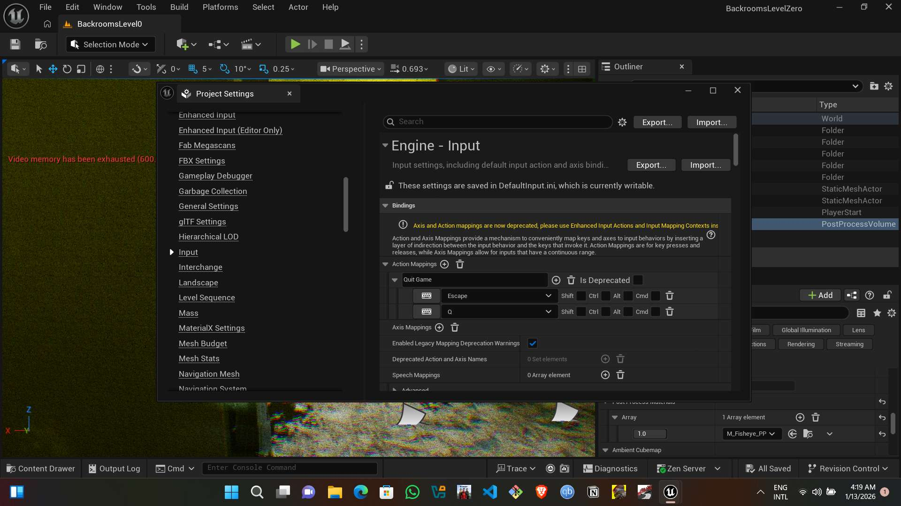

**Setting Default Levels:**
- Still in Project Settings
- Go to **Maps & Modes** at top
- Find **Default Maps**:
  - **Editor Startup Map**: Select "BackroomsLevelZero"
  - **Game Default Map**: Select "BackroomsLevelZero"
- This ensures correct level opens in editor and built game

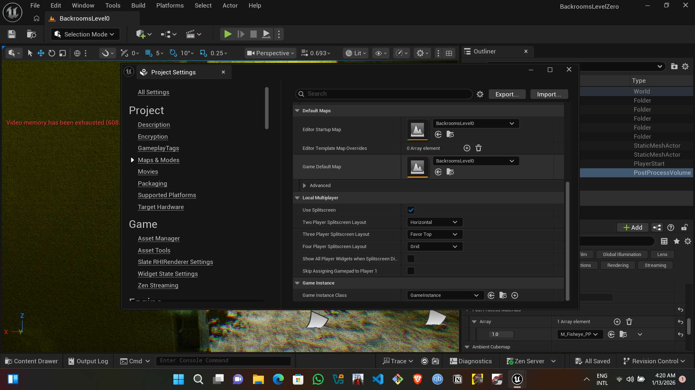

**Adding Quit Logic:**
- Press Ctrl+Space for content browser
- Go to top level
- Search for "first"
- Open "BP_FirstPersonCharacter"
- Go to **Event Graph** tab

**Creating Quit Event:**
- Find empty space in Event Graph
- Right-click
- Type "input action quit"
- Select "InputAction QuitGame"
- Creates input node with "Pressed" output
- Drag from "Pressed"
- Type "quit game"
- Select "Quit Game" function
- Connects action to quit function

**Finalizing:**
- Click **Compile**
- Click **Save**
- Close blueprint
- Now Q or Escape will quit game (no need for Alt+F4 or Task Manager)

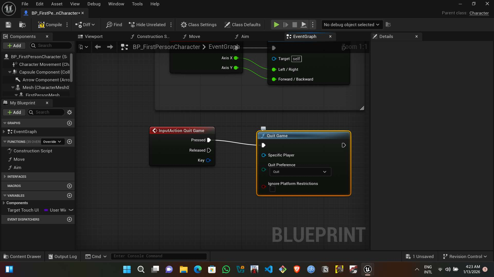

**Building for Windows**

**Prerequisites:**
- Must have Windows SDK installed
- May need to install on first build
- Follow these steps BEFORE packaging:

**Installing SDK (if needed):**
1. Download and copy specific file (see Unreal documentation link)
   1. https://forums.unrealengine.com/t/are-you-unable-to-package-windows-projects-in-ue5-fear-not-i-have-a-solution-for-you/231593  
   2. "C:\Program Files\Epic Games\UE_5.7\Engine\Binaries\ThirdParty\DotNet\8.0.412\win-x64\host\fxr\8.0.18\hostfxr.dll"
   3. to "C:\Program Files\Epic Games\UE_5.7\Engine\Binaries\DotNET\AutomationTool\"
2. Install .NET Core Runtime https://download.visualstudio.microsoft.com/download/pr/d30352fe-d4f3-4203-91b9-01a3b66a802e/bb416e6573fa278fec92113abefc58b3/windowsdesktop-runtime-3.1.15-win-x64.exe
3. Restart PC completely after installation

**Verification:**
- Once SDK installed, Unreal will show "Installed SDK" in packaging menu

**Packaging Steps:**
- Go to **Platforms** menu
- Select **Windows**

**Choosing Build Configuration:**
- During development: Use Debug or Development
- For final distribution: Select **Shipping**
- Shipping mode:
  - Smaller file size
  - Optimized performance
  - No debug features

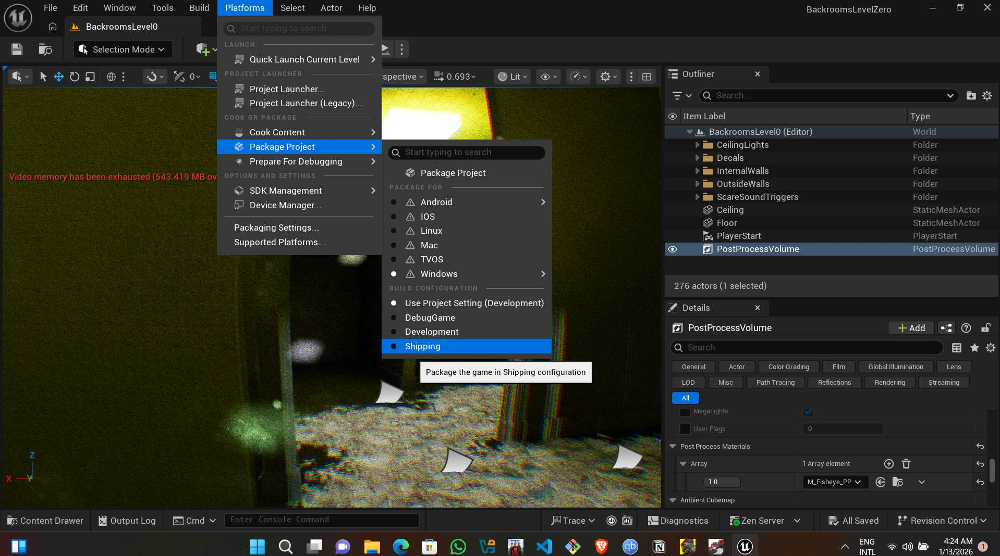

**Setting Output Folder:**
- Click **Package Project**
- Select output folder location
- Recommendation: In project folder
- Create new folder: "Build"
- Select "Build" folder
- Click "Select Folder"

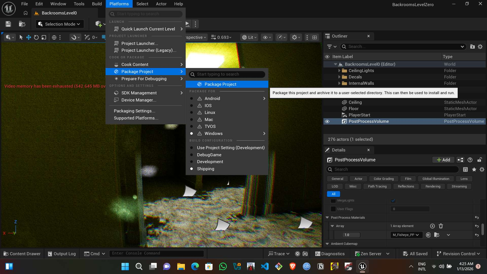

**Build Process:**
- Shows "Packaging Project for Windows" message
- Can click "Show Output Log" to see details
- First build: May take 30 minutes or longer
- Subsequent builds: Much faster (30 seconds to few minutes)
- Wait for "Build Successful" message

**Locating Built Game:**
- Navigate to project folder in Windows Explorer
- Go to Build folder
- Inside: "Windows" folder
- Contains all game files
- Main executable: "BackroomsTutorial.exe"

**Distribution:**
- Zip entire "Build/Windows" folder contents
- Send to others
- Recipients unzip and run .exe file

**Testing Built Game:**
- Double-click .exe file
- Game launches
- Test all features:
  - Movement with WASD
  - Camera shake
  - VHS static sound
  - Trigger sound near graffiti
  - Quit with Q or Escape

---

**ADDITIONAL CUSTOMIZATION OPTIONS**

**Extending the Project:**
- Can build on this foundation
- Add more levels
- Modify materials further
- Add more audio triggers
- Create additional post-processing effects
- Experiment with lighting

**Other Backrooms Levels:**
- Tutorial focused on Level Zero
- Can create other backroom levels using same techniques
- Modify materials and layout for different levels

**Tips for Further Development:**
- Save frequently (Ctrl+S)
- Test in play mode regularly
- Keep outliner organized with folders
- Name assets clearly
- Adjust exposure after lighting changes
- Use post-processing effects sparingly for best performance

**Performance Optimization:**
- Use medium quality textures for better performance
- Limit number of lights if needed
- Test on target hardware
- Shipping build is optimized automatically

---

**SUMMARY OF KEY SHORTCUTS**

**Navigation:**
- Right-click + WASD: Move around viewport
- Right-click + Q/E: Move down/up
- F: Focus on selected object
- G: Toggle game view/editor view

**Tools:**
- W: Move tool
- E: Rotate tool
- R: Scale tool
- Alt + Drag: Duplicate object

**Organization:**
- Ctrl+G: Group selected objects
- Shift+G: Ungroup
- F2: Rename
- Ctrl+S: Save
- Ctrl+Space: Toggle content browser

**Play Mode:**
- Play button: Start game
- Escape: Exit play mode
- F11: Toggle full screen (in play mode)

**Materials:**
- 1: Create scalar value (single number)
- 3: Create color constant
- U: Create texture coordinate
- Asterisk (*): Create multiply node

---

